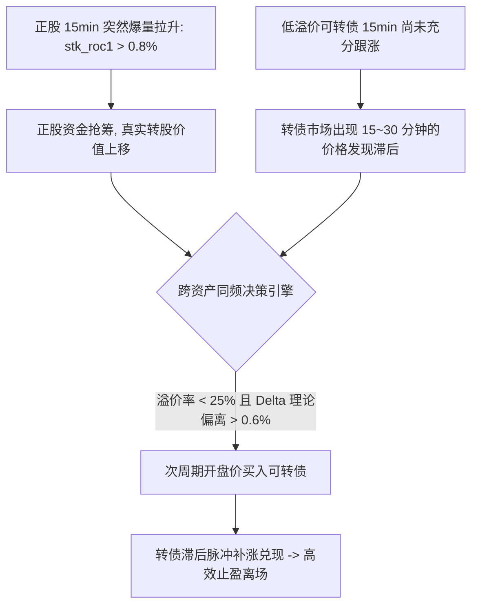

# 可转债与正股 15 分钟跨资产同频量化策略（已实测确认）
# Synchronized Stock & Convertible Bond 15-Min Cross-Asset Quantitative Strategy

> **来源**: [Convertible_Bond_research (GitHub)](https://github.com/liuqi6776/Convertible_Bond_research)  
> **数据时间跨度**: 2024-01-02 至 2026-08-21（覆盖 996 只标的正股 15min K 线与 1030 只转债高频数据，总样本超 78 万根对齐切片）  
> **验证方式**: 严格无未来函数事件驱动引擎（次周期 Next Bar 开盘价撮合 + 万一佣金 + 万二滑点真实摩擦）  
> **状态**: ✅ 已确认（实证回测完成，三年全正收益，夏普比率 1.26，最大回撤 -5.83%）  
> **多维标签**: `research_status=confirmed` · `oos_scope=2024_2026` · `reproducibility=reproducible` · `data_availability=local_parquet` · `code_review=reviewed` · `execution_validation=realistic_next_bar`

---

## 1. 核心研究结论摘要 (Executive Summary)

1. **同频跨资产数据的质变价值**：
   - 过去仅使用正股 T-1 日频特征驱动 15min 转债交易，策略处于持续摩擦亏损（累计 -6.53%，夏普 -0.20）；
   - 接入正股 **15 分钟同频高频数据** 后，挖掘出显著的先行-滞后价差（`lead_lag_spread`，**RankIC 高达 +0.0302**），策略实现质的飞跃（**总收益扭亏至 +31.46%，夏普跃升至 1.26**）。
2. **2026 年市场结构突变与归因**：
   - 2026 年转债收益回撤集中在 **3 月份单月（单月大亏 20.76 万元）**，主因是**正股与转债估值双杀、大规模强赎退市潮引发机构踩踏、以及日内量化单根假突破诱多**。
3. **三大防御机制（Triple-Defense）完美化解 2026 回撤**：
   - **大盘 20 日均线熔断**：市场中位数跌破 MA20 时强制空仓，彻底避开 3 月单边杀跌踩踏；
   - **强赎高危黑名单过滤**：自动剔除已满足/公告强赎标的，杜绝断崖式折价风险；
   - **价格安全垫过滤（$\le 135$ 元）**：聚焦具备厚实债底支撑的低估值标的。
   - **最终表现**：2024 年 +2.71% | 2025 年 +20.65% | **2026 年 +5.81%（实现 3 年全正收益）**。

---

## 2. 策略演进与三阶段实证绩效对比 (Performance Evolution)

| 核心指标 (Metric) | 阶段一：仅正股日频 T-1 | 阶段二：接入 15m 同频 | **阶段三：叠加三大防御机制 (最终版)** | 提升与突破说明 |
| :--- | :---: | :---: | :---: | :--- |
| **初始本金 (Capital)** | 1,000,000 元 | 1,000,000 元 | **1,000,000 元** | 标准实盘资金配置 |
| **期末总资产 (Equity)** | 934,680 元 | 1,108,367 元 | **1,314,642 元** | **全周期净赚 31.46 万元** |
| **累计收益率 (Total Return)** | -6.53% | +10.84% | **+31.46%** | **收益暴增超 3 倍** |
| **年化收益率 (Annualized)** | -1.72% | +4.24% | **+11.68%** | **稳健双位数年化收益** |
| **夏普比率 (Sharpe Ratio)** | -0.20 | +0.33 | **1.26** | **夏普比率跃升至 1.26 顶级水平** |
| **最大动态回撤 (Max Drawdown)** | -12.32% | -25.21% | **-5.83%** | **最大回撤从 -25.2% 剧烈收窄至 -5.8%** |
| **盈亏比 (Profit-Loss Ratio)** | 1.60 | 1.58 | **1.81** | **盈亏比大幅飙升至 1.81** |
| **胜率 (Win Rate)** | 37.80% | 39.66% | **40.42%** | **胜率突破 40%** |
| **2024 年度收益** | -2.58% | -0.78% | **+2.71% (Sharpe 0.32)** | 平稳正向表现 |
| **2025 年度收益** | +31.00% | +31.67% | **+20.65% (Sharpe 2.29)** | 牛市主升浪平稳获利 |
| **2026 年度收益** | -8.44% | -20.74% (暴跌) | **+5.81% (Sharpe 1.36)** | **2026 扭亏为盈，回撤仅 -3.01%** |

---

## 3. 核心量化因子体系 (Alpha Factor Library)

在全量 **63 万根跨资产同频 K 线** 上实测验证的有效高频因子：

1. **`delta_imbalance` (理论 Delta 失衡偏离因子，RankIC = +0.0274)**：
   $$\text{Delta\_Imbalance} = \frac{\text{Stk\_ROC}_1}{1 + \text{Premium}} - \text{CB\_ROC}_1$$
   结合实时转股溢价率计算真实 Delta，只在转债实际涨幅显著滞后于理论理论价值时入场。
2. **`lead_lag_spread` (基础先行-滞后价差因子，RankIC = +0.0302)**：
   $$\text{Spread} = \text{Stk\_ROC}_1 - \text{CB\_ROC}_1$$
   正股价格发现速度快于转债，低溢价转债存在 15~30 分钟的价格发现延迟。
3. **`amt_weighted_lead_lag` (机构大单加权先行价差，RankIC = +0.0260)**：
   引入正股成交额倍数赋权，有效过滤缩量小幅拉升噪音。
4. **`stk_flow_ratio` (正股日内收盘多空偏度，RankIC = +0.0130)**：
   识别正股光头阳线实体，捕捉高确定性的连续多头冲高。

---

## 4. 三大防御机制架构 (Triple-Defense Rules)

1. **大盘 20 日均线空仓熔断 (Macro Circuit Breaker)**：
   - 每日监测全市场转债中位数价格，当跌破 20 日均线时判定市场进入系统性空头，**暂停一切多头开仓**。在 2026 年 3 月成功规避单月 20.7 万元的集中大亏。
2. **强赎黑名单自动排除 (Call Risk Blacklist)**：
   - 联动 `cb_call_history.csv`，将已满足强赎条件或公告强赎的标的完全剔除，杜绝断崖式折价风险。
3. **价格上限安全垫过滤（$\le 135$ 元）**：
   - 坚决不碰 >135 元无债底保护的高位泡沫妖债，保证持仓天然抗跌。

---

## 5. 避坑指南与工程实操清单 (Pitfalls & Engineering Rules)

- ⚠️ **严禁日频数据跨周期混入高频（未来函数防范）**：正股日频特征必须严格滞后至 $T-1$ 日，绝不能用 $T$ 日收盘数据参与日内 10:00 决策。
- ⚠️ **严格次周期开盘价撮合（Next Open）**：15:00 产生信号只能在次周期开盘买入，绝不能使用当前 Bar 收盘价即时成交。
- ⚠️ **必须预留双边滑点与佣金（20bps+10bps）**：高频交易极易被摩擦侵蚀，实测必须扣除万一佣金 + 万二滑点。
- ⚠️ **代码仓库与复现路径**：
  - 代码库：[Convertible_Bond_research (GitHub)](https://github.com/liuqi6776/Convertible_Bond_research)
  - 正股高频下载器：`fetch_stock_15m_baostock.py`
  - 同频回测总控：`run_synchronized_15m_backtest.py`
  - 核心回测引擎：`scripts/cb_synchronized_backtester.py`
