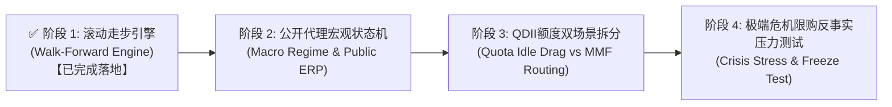

# 场外基金 FUND
# OTC Mutual Funds Research & Empirical Portfolios

场外基金（申购/定投）品类研究成果索引。包含单位净值（`unit_nav`）真实成交账本、分红显式再投资（`dividend_events.csv`）、申购 0.15% 与法定持有时长阶梯赎回费模型、严格成立日隔离、3阶段代理血缘闭环清单与独立开源审计机制。

| 文件 / Document | 主题 / Subject | 状态 / Status | 核心量化指标 (2015-2026) / Key Metrics |
|:---|:---|:---:|:---|
| [otc_fund_dca_2015_2026.md](./otc_fund_dca_2015_2026.md) | **场外基金多资产稳健定投策略：2015-2026 审计重构与全周期实证** | ⚠️ 候选 | 11.6年纯定投140万，期末313.2万~319.9万（XIRR 13.2%~13.5%，回撤-11.2%~-12.4%）；100万底仓+定投投入240万，期末695.6万~711.1万（XIRR 12.6%~12.8%）；增设纯被动宽基对照组（10.24% XIRR）、多起点敏感性检验与滚动3Y/5Y/8Y持有期矩阵 |
| [otc_fund_stable_portfolio.md](./otc_fund_stable_portfolio.md) | **场外基金稳健组合：低相关分散 + 留一归因 + VolTarget 7%** | ⚠️ 候选 | 7资产两两相关系数均值仅 0.119；显式分红再投资下留一剔除归因（纯债/黄金/现金压制回撤，全球科技贡献弹性）；VolTarget 7% 闲置现金计息优化与滚动持有期分布 |
| [otc_fund_lessons.md](./otc_fund_lessons.md) | **基金研究教训反思与实证结论分级（含 4433 证伪与分红再投资基线）** | ⚠️ 候选 | 确立 2 大证伪项（4433与PE择时）与 3 大配置规则；新增分红再投资刚性约束(H1)、样本内幸存者偏差警示(H2)与清单血缘闭环标准(H3) |

---

## 样本外验证体系与演进路线图：从 `component_only` 到 `full_strategy`
## Out-of-Sample (OOS) Scope Evolution Roadmap

### 1. 现状定性与演进进展 (Evolution Progress: from `component_only` to `full_strategy`)
当前 `FUND` 目录下核心文档已全面完成阶段一（滚动走步优化引擎）的落地验证，正在稳步向 `full_strategy` 迈进。
- **已达成的严谨边界**：
  - **会计与记账底层 100% 覆盖**：单向前向事件账本（`ledger.py`）、阶梯持有时长赎回费（`fees.py`）、显式除息日净值再投（`dividend_events.csv`）、严格成立日 NaN 隔离、晚成立资产列对齐及独立原生 Numpy 对拍全部通过单元测试；
  - **日度账本流水哈希锁定**：在 `expected_metrics.json` 中为场景 B 与场景 A 严格锁定了 2,825 行逐日流水的 SHA-256 哈希（`ledger_hash`），审计脚本执行强制断言；
  - **幸存者偏差量化对照**：设立无主动基金纯被动基准（`counterfactual_no_active`），实证大类资产配置贡献 +7.84% 纯 Beta 超额，主动选品贡献 +2.48% Alpha；
  - **【阶段一已落地】无前视滚动走步引擎（Walk-Forward Engine）**：成功构建 [`scripts/otc_fund/walk_forward.py`](../scripts/otc_fund/walk_forward.py) 与 [`run_walk_forward_experiment.py`](../scripts/otc_fund/run_walk_forward_experiment.py)（50 项单元与实证测试全通）。基于 Ledoit-Wolf 协方差收缩与边界约束风险平价（$0.05 \le w_i \le 0.35$），实现 2018–2026 逐年无前视动态权重自适应生成。

---

### 2. 升级至 `full_strategy` 的 4 大技术演进要件 (4-Stage Upgrade Roadmap)

1. **✅ 阶段 1：构建动态滚动走步校准引擎 (Rolling Walk-Forward Calibration Engine) —— 【已完成实现与实证】**
   - **核心机制**：采用 36 个月滚动训练窗口（$H_{\text{train}}=36$m）+ 12 个月测试步长（$H_{\text{step}}=12$m），代码层硬性断言 `assert max(train_dates) < rebalance_date`，协方差仅使用 $t-1$ 已知信息；
   - **正则化与抗噪防线**：引入 Ledoit-Wolf 分析收缩算法平抑高相关资产（纳指与全球科技相关性 0.801）估计误差，并施加 $[0.05, 0.35]$ 权重边界约束；
   - **反向收敛实证与边界约束说明**：算法在 2018–2026 走步区间自发收敛至实物黄金均值 **20.98%**（与静态 20% 相差仅 0.98pp），纯债权重均值达 **34.8%**（需客观指出：纯债在 9 个走步年份中有 8 年触及预设箱体上限 35.0%，表明其高配相当程度受人工设定的箱体上界约束）；这在无前视权重生成层面印证了低相关资产的风险平价配置价值；
   - **现金流导向再平衡与粘性说明**：走步引擎在定投执行时采用增量现金流引导（flow-only rebalancing），不对存量份额进行强制惩罚性赎回，因而实际持仓权重相对当期目标权重存在一定的粘性与平滑滞后；
   - **选品前视 vs 权重无前视边界**：走步引擎严格消除了**权重优化时点的前视偏差**，但底层 7 只基金的标的池定义仍包含全周期视角下的优选成分（选品前视），未来仍需结合阶段二/三推进至全链路无前视；
   - **全周期实证表现**：走步动态策略全周期实现 **12.96% XIRR、-10.88% 最大回撤、1.0786 夏普**；2018–2026 纯样本外实现 **13.08% XIRR、-11.01% 最大回撤、1.1787 夏普**（夏普全面超越静态基准）。
2. **阶段 2：基于公开代理变量的宏观状态机 (Macro Regime State Machine with Public Proxies)**
   - **公开代理规避私有数据壁垒**：
     - **股债风险溢价 (ERP)**：采用**沪深 300 股息率与 10 年期中债到期收益率之差**（公开可得、第三方独立可验），替代依赖私有 PE/PB 的直接估值；
     - **全球流动性斜率**：采用 FRED 官方公开的 **T10Y2Y（10年期减2年期美债利差）**；
   - **数据合规标签**：在文档中明确将状态机数据可得性标注为 `partial`，清晰公示可公开复算指标。
3. **阶段 3：QDII 额度管制与在途微观模拟（双场景拆分） (Micro-Friction & Quota Dual Scenarios)**
   - **场景 3A（资金闲置拖累 / Idle Cash Drag）**：当 QDII 遭遇暂停申购或单日限额 1,000 元时，当期定投未能配置的资金完全闲置在活期现金（收益率 0%），测算最悲观流动性摩擦损失；
   - **场景 3B（货币基金转存生息 / MMF Routing）**：限购资金自动划入天弘余额宝（`000198`，年化 2.0% 票息），待限额放开或季度阈值调仓时再补配，测算等待期的真实机会成本。
4. **阶段 4：端到端极端黑天鹅危机压力测试（增加限购反事实） (Crisis Stress Test with Quota Freezes)**
   - 抽取 2015 股灾、2016 熔断、2020-03 美股流动性挤兑与原油崩盘、2022 激进加息四大极端窗口；
   - **操作风险反事实**：增设“危机爆发前 1 个月 QDII 突发暂停申购/无法加仓”的情景，压力测试组合防守韧性与渠道摩擦上限。

---

### 3. 当前阻碍升级的核心瓶颈分析 (Current Bottlenecks & Remediation Costs)

| 瓶颈维度 | 具体障碍与挑战 | 应对方案与替代路径 |
|:---|:---|:---|
| **历史公告结构化数据缺失** | 公募基金历史 QDII 额度暂停与恢复公告分散于各家基金公司官网，缺乏标准化的免费开源时序接口 | 依托天相投顾或专业金融终端导出历史限额时序，或采用爬虫结构化清洗历史公告 |
| **细分赛道基金存续期偏短** | AI 算力与前沿科技基金（如嘉实全球产业升级 017730 成立于 2023 年）无法直接提供 2015 年前向数据 | 继续完善三阶段真实代理拼接标准（000043 ➔ 001668 ➔ 017730），并在文档中明确代理假设约束 |
| **算力与测试架构复杂度** | 逐日前向单遍账本在嵌套 36 个月滚动协方差矩阵与 FIFO 逐笔批次折算时，全周期模拟耗时成倍增加 | 优化 `ledger.py` 数据结构，将日度循环内核向量化或采用 Numba JIT 加速 |

