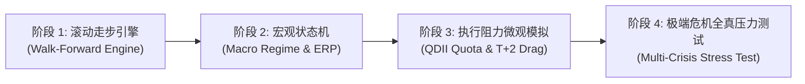

# 场外基金 FUND
# OTC Mutual Funds Research & Empirical Portfolios

场外基金（申购/定投）品类研究成果索引。包含单位净值（`unit_nav`）真实成交账本、分红显式再投资（`dividend_events.csv`）、申购 0.15% 与法定持有时长阶梯赎回费模型、严格成立日隔离、3阶段代理血缘闭环清单与独立开源审计机制。

| 文件 / Document | 主题 / Subject | 状态 / Status | 核心量化指标 (2015-2026) / Key Metrics |
|:---|:---|:---:|:---|
| [otc_fund_dca_2015_2026.md](./otc_fund_dca_2015_2026.md) | **场外基金多资产稳健定投策略：2015-2026 审计重构与全周期实证** | ⚠️ 候选 | 11.6年纯定投140万，期末313.2万~319.8万（XIRR 13.2%~13.5%，回撤-11.2%~-12.4%）；100万底仓+定投投入240万，期末695.6万~711.0万（XIRR 12.6%~12.8%）；增设纯被动宽基对照组（10.24% XIRR）与多起点敏感性检验 |
| [otc_fund_stable_portfolio.md](./otc_fund_stable_portfolio.md) | **场外基金稳健组合：低相关分散 + 留一归因 + VolTarget 7%** | ⚠️ 候选 | 7资产两两相关系数均值仅 0.119；显式分红再投资下留一剔除归因（纯债/黄金/现金压制回撤，全球科技贡献弹性）；VolTarget 7% 闲置现金计息优化 |
| [otc_fund_lessons.md](./otc_fund_lessons.md) | **基金研究教训反思与实证结论分级（含 4433 证伪与分红再投资基线）** | ⚠️ 候选 | 确立 2 大证伪项（4433与PE择时）与 3 大配置规则；新增分红再投资刚性约束(H1)、样本内幸存者偏差警示(H2)与清单血缘闭环标准(H3) |

---

## 样本外验证体系与演进路线图：从 `component_only` 到 `full_strategy`
## Out-of-Sample (OOS) Scope Evolution Roadmap

### 1. 现状定性与诚实定位 (Current Status: `component_only`)
当前 `FUND` 目录下核心文档的多维标签中，`oos_scope` 均诚实定性为 **`component_only`（仅底层组件完成样本外与单元验证）**。
- **已达成的严谨边界**：
  - 会计与记账引擎（`ledger.py`）、阶梯持有时长赎回费（`fees.py`）、现金分红除息日净值再投（`dividend_events.csv`）、成立日前严格 NaN 隔离等底层组件已实现 **100% 单元测试覆盖 (19/19 tests)**；
  - 进行了 2015–2020（样本内探索）与 2021–2026（样本外验证）的切分对比，并在 `expected_metrics.json` 中锁定了日度账本流水 SHA-256 摘要（`ledger_hash`）；
  - 增设了无主动基金反事实对照组（`counterfactual_no_active`），剔除选品偏差后大类资产底色超额依然稳健。
- **距离 `full_strategy` 的客观差距**：
  - 组合中各资产的目标配置比例（如纯债 25%、黄金 20%、纳指 15% 等）目前仍为**全周期静态权重**，带有事后全局优选痕迹；
  - 尚未构建完全自动化的滚动前向走步优化（Rolling Walk-Forward Parameter Optimization）引擎，未实现无参数窥视的动态权重滚动生成。

---

### 2. 升级至 `full_strategy` 的 4 大技术演进要件 (4-Stage Upgrade Roadmap)

1. **阶段 1：构建动态滚动走步校准引擎 (Rolling Walk-Forward Calibration Engine)**
   - **机制设计**：设定 36 个月为滚动历史训练窗口（Train Window），基于逆波动率或风险平价（Risk Parity）模型求解当期最优风险预算，并在随后 12 个月（Test Window）中进行严格无前视的样本外定投执行；
   - **交付标准**：彻底剥离人工静态权重预设，全周期权重由滚动算法自适应输出，且历史参数调整只基于 $t-1$ 日已知协方差矩阵。
2. **阶段 2：引入宏观状态机与股债风险溢价 (Macro State Machine & Equity Risk Premium)**
   - **机制设计**：引入十年期国债收益率倒数与沪深 300 估值计算的股债利差（ERP），结合美债收益率曲线斜率，构建多资产宏观状态机；
   - **交付标准**：在股票处于极端低估时自动倾斜权益现金流，在高波滞胀期自动超配黄金与短债，形成自适应动态风险预算。
3. **阶段 3：QDII 额度管制与资金在途微观模拟 (Micro-Friction & Quota Modeling)**
   - **机制设计**：模拟公募 QDII 外汇额度耗尽引起的临时性“暂停申购”、“单日限购 1,000 元”现象，以及 QDII 赎回后 T+2 确认、T+4 到账的现金拖累效应；
   - **交付标准**：量化微观限额与流动性冲击对实盘定投跟踪误差的影响。
4. **阶段 4：端到端极端黑天鹅危机压力测试套件 (Multi-Crisis Stress Testing)**
   - **机制设计**：抽取 2015 股灾与流动性踩踏、2016 熔断、2020 负油价与美股四次熔断、2022 美联储激进加息四重历史大冲击窗口，运行全真事件驱动审计。

---

### 3. 当前阻碍升级的核心瓶颈分析 (Current Bottlenecks & Remediation Costs)

| 瓶颈维度 | 具体障碍与挑战 | 应对方案与替代路径 |
|:---|:---|:---|
| **历史公告结构化数据缺失** | 公募基金历史 QDII 额度暂停与恢复公告分散于各家基金公司官网，缺乏标准化的免费开源时序接口 | 依托天相投顾或专业金融终端导出历史限额时序，或采用爬虫结构化清洗历史公告 |
| **细分赛道基金存续期偏短** | AI 算力与前沿科技基金（如嘉实全球产业升级 017730 成立于 2023 年）无法直接提供 2015 年前向数据 | 继续完善三阶段真实代理拼接标准（000043 ➔ 001668 ➔ 017730），并在文档中明确代理假设约束 |
| **算力与测试架构复杂度** | 逐日前向单遍账本在嵌套 36 个月滚动协方差矩阵与 FIFO 逐笔批次折算时，全周期模拟耗时成倍增加 | 优化 `ledger.py` 数据结构，将日度循环内核向量化或采用 Numba JIT 加速 |

