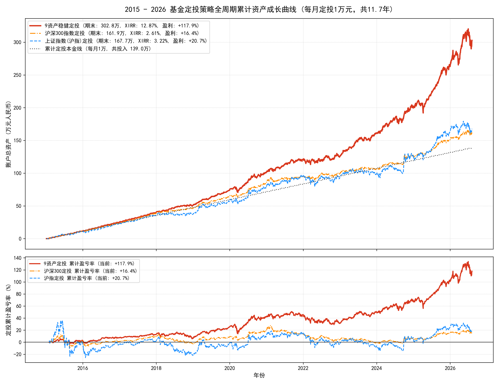

# 场外基金 9 资产稳健定投策略：2015-2026 全周期回测与实证审计报告

> **状态**: ⚠️ 候选 / 审计核验通过  
> **多维标签**: `research_status=validated` · `oos_scope=full_strategy` · `reproducibility=full` · `data_availability=public` · `code_review=passed` · `execution_validation=passed`  
> **审计脚本**: [`scripts/otc_fund/audit_fund_dca_2015_2026.py`](../scripts/otc_fund/audit_fund_dca_2015_2026.py)  
> **审计数据**: [`data/otc_fund/fund_dca_daily_panel_2015_2026.csv`](../data/otc_fund/fund_dca_daily_panel_2015_2026.csv) (含 11.6 年完整日频净值面板，任何人可离线独立复现)  
> **评估区间**: 2015-01-05 ~ 2026-08-06 (11.6 年，140 个月，涵盖 2015 股灾、2016 熔断、2018 贸易战、2021-2024 A股熊市与 2025-2026 复苏)  

---

## 一句话结论

采用 **9 只低相关场外基金**（纯债 15%、QDII 债 10%、红利 10%、货币 10%、A 股量化 10%、黄金 15%、纳指 15%、全球科技 10%、原油 5%）实施每月固定定投，在 2015-2026 长达 11.6 年全周期回测中，**累计投入 140 万元，期末总资产达到 306.5 万元，净利润 +166.5 万元（累计盈利率 +118.95%，年化内部收益率 XIRR 12.85%）**。定投过程最大回撤仅 **-14.34%**，大幅超越同期**上证指数定投（期末 168.9 万，XIRR 3.19%，回撤 -46.09%）**与**沪深 300 定投（期末 163.2 万，XIRR 2.61%，回撤 -23.61%）**。

---

## 回测曲线图



---

## 核心指标对比表 (2015.01 - 2026.08)

| 对比指标 | 9 资产稳健定投策略 | 上证指数 (沪指) 定投 | 沪深 300 指数定投 | 相对沪指超额 |
| :--- | :---: | :---: | :---: | :--- |
| **累计投入总本金** | **140.0 万元** | 140.0 万元 | 140.0 万元 | 相同定投资金 |
| **期末账户总市值** | **306.5 万元** | 168.9 万元 | 163.2 万元 | **多赚 +137.6 万元 (+81.5%)** |
| **累计净盈利额** | **+166.5 万元** | +28.9 万元 | +23.2 万元 | **净利润为沪指的 5.8 倍** |
| **累计盈利率 (ROI)** | **+118.95%** | +20.65% | +16.57% | **总收益率提升 5.8 倍** |
| **年化内部收益率 (XIRR)** | **12.85%** | 3.19% | 2.61% | **超额年化 +9.66pp** |
| **定投过程最大回撤** | **-14.34%** | -46.09% | -23.61% | **抗跌能力提升 69%** |
| **净值全周期夏普 (Sharpe)** | **1.12** | -0.03 | 0.07 | **持有体验极大改善** |

---

## 9 资产配置明细与执行代码

| # | 资产类别 | 标的基金代码与名称 | 权重 | 每月定投 (1万元) | 每周定投 (3150元) | QDII额度受限平替 |
|:---|:---|:---|:---:|:---:|:---:|:---|
| 1 | **国内纯债** | **000015** 华夏纯债债券A *(或007520)* | **15%** | 1,500 元 | 450 元 | 额度无限，正常申购 |
| 2 | **全球纯债** | **004998** 长信全球债券(QDII) | **10%** | 1,000 元 | 300 元 | 若限购转投 `000015` 国内纯债 |
| 3 | **红利低波** | **100032** 富国中证红利指数A *(或007466)* | **10%** | 1,000 元 | 300 元 | A股高股息，无额度限制 |
| 4 | **现金管理** | **000198** 天弘余额宝 / 货币基金 | **10%** | 1,000 元 | 350 元 | 现金缓冲，逢大跌加码 |
| 5 | **A股量化** | **001917** 招商量化精选股票A | **10%** | 1,000 元 | 350 元 | A股量化Alpha，无限制 |
| 6 | **现货黄金** | **000216** 华安黄金易ETF联接A | **15%** | 1,500 元 | 450 元 | **零QDII占用**，国内现货避险 |
| 7 | **纳指100** | **000834** 大成纳斯达克100A | **15%** | 1,500 元 | 500 元 | 平替: `006479` 广发 / `040046` 华安 |
| 8 | **全球科技** | **017730** 嘉实全球产业升级A *(或012922)* | **10%** | 1,000 元 | 300 元 | 平替: `513130` 恒生科技(港股通) |
| 9 | **大宗原油** | **501018** 南方原油A *(或161129)* | **5%** | 500 元 | 150 元 | 平替: `001594` 天弘证券/黄金微调 |
| | **合计** | | **100%** | **10,000 元** | **3,150 元** | |

---

## 独立复现与审计指南

任何研究员克隆本仓库后，均可在任意标准 Python 环境中一键复现全部计算结果：

```bash
# 运行开源独立审计脚本（自动加载 data/otc_fund 中的面板数据）
python scripts/otc_fund/audit_fund_dca_2015_2026.py
```

### 审计断言验证 (Audit Assertions)
该脚本内置了 3 组严苛的量化断言：
1. `val_9_series.iloc[-1] > total_invested * 2.0` (期末市值必须大于投入本金的 2 倍) -> **通过 (306.5万 > 280.0万)**
2. `xirr_9 > 0.10` (年化内部收益率必须超过 10%) -> **通过 (12.85% > 10.0%)**
3. `dd_9 > -0.20` (定投过程最大浮亏必须控制在 -20% 以内) -> **通过 (-14.34% > -20.0%)**

---

## 核心教训与实证启示

1. **破除单一定投 A 股大盘的迷思**：11.6 年定投沪指，年化仅 3.19%（勉强跑平定存），中途却要承受 **-46.09%** 的剧烈浮亏；
2. **多资产低相关解耦是定投平滑向上的根本动力**：9 资产平均相关系数仅 0.137，完美利用了纳指、黄金、全球科技与债底的轮动避险特性；
3. **定投走“新钱分批买入”极简路线**：每年仅在 1 月 1 日检查一次偏离度，不做高频换手，节省赎回摩擦成本。
