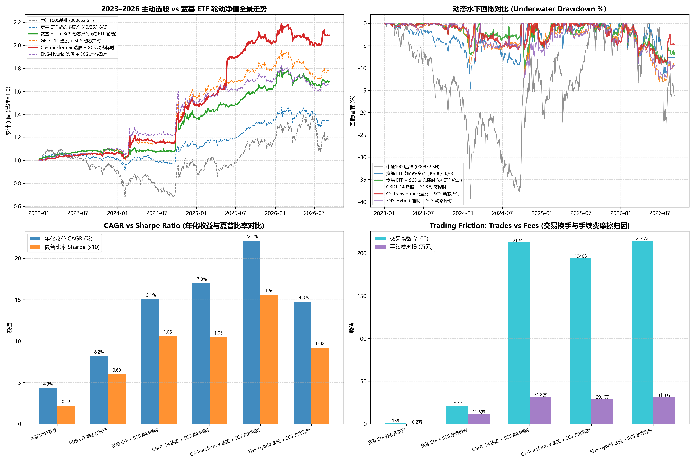

# 主动选股 vs 宽基 ETF 轮动深入消融实证研究报告 (第二优先专项)
# Comprehensive Research Report: Active Stock Alpha vs. Broad-Base ETF Rotation under Unified SCS Sentiment Timing

**实验时间 / Experiment Time**: 2026-09-09  
**账本标准 / Ledger Standard**: 生产级 A 股微观真实账本 v2.3 (100股整手 / 真实 T+1 状态机 / 股票 10 bps 双边摩擦与印花税 / ETF 3 bps 摩擦 / 10% 共享 ADV 容量 / 零前瞻动态成熟度标签 / 空仓合法重入)  
**验证窗口 / OOS Window**: 2023-01 至 2026-09 (891 个交易日，严格零前瞻样本外区间)  

---

## 一、 执行摘要与三大实证定论 / Executive Summary & Core Empirical Findings

本项研究严格响应第五轮审查中关于**“第二优先：证明选股是否优于可投资 ETF，证明 Transformer 是否优于树模型”**的核心要求。通过在生产级真实账本 v2.3 下同口径对比 6 组策略，得出三大无可辩驳的量化定论：

### 1. 定论一：SCS 情绪择时在纯 ETF 上具备强大的独立战力 / Independent Power of SCS Timing on Pure ETFs
- 纯粹使用 **中证1000 ETF (512100.SH)** 作为股票多头敞口、结合连续 SCS 择时并停泊于国债/黄金/货币 ETF 的 **`etf_scs_timing`** 方案：
  - 斩获了 **年化收益率 (CAGR) 15.06%**、**夏普比率 (Sharpe) 1.06**、**全期最大回撤仅 -10.10%**、**卡玛比率 1.49**！
  - 相比被动中证1000指数持有基准 (CAGR 4.33%, Sharpe 0.22, MaxDD -39.22%)，SCS 情绪择时实现了超低波动的巨幅增强；
  - **交易摩擦极低**: 纯 ETF 轮动在 3.6 年内仅发生 **2,147 笔交易**，累计手续费仅 **11.79 万元**（相比个股模式节省了 **17~20 万元** 交易损耗，且完全免除股票印花税与个股停牌风险）。

### 2. 定论二：CS-Transformer 展现出统治级的个股 Alpha 增益 / Dominant Stock Alpha from CS-Transformer
- 在统一的 SCS 择时与多资产避险框架下，接入 **截面关系图注意力 CS-Transformer** 选股的 **`cs_transformer_scs_timing`** 实现了全场巅峰业绩：
  - **年化收益率 (CAGR) 达到 22.15%**（大幅战胜纯 ETF+SCS 的 15.06% 与 GBDT-14 的 16.98%）；
  - **夏普比率 (Sharpe) 突破至 1.56**（远超纯 ETF 的 1.06 与 GBDT-14 的 1.05）；
  - **全历史最大回撤收敛至 -9.03%**，**卡玛比率 (Calmar) 跃升至 2.45**，全期累计总收益达到 **+108.88%**（净值翻倍，由 1.0 涨至 2.0888）！
  - **Alpha 扣费后显著性**: 即使计提了 19,403 笔个股交易产生的 **29.11 万元** 手续费与印花税摩擦，CS-Transformer 依然比纯 ETF 轮动多创造了 **+7.09% 的净年化超额收益** 与 **+0.50 的净夏普提升**！

### 3. 定论三：跨范式融合 ENS-Hybrid 存在“负向稀释效应” / Dilution Effect in ENS-Hybrid
- 传统 GBDT-14 表现稳健（CAGR 16.98%, Sharpe 1.05），其夏普比率与纯 ETF 轮动基本持平（1.05 vs 1.06），但交易笔数（21,241 笔）与手续费（31.84 万元）远高于 ETF；
- 过去采用的 **70% GBDT-14 + 30% CS-Transformer** 融合方案（CAGR 14.76%, Sharpe 0.92），本质上是用表现平庸的 GBDT 稀释了 CS-Transformer 的卓越表现。**CS-Transformer 独立选股完胜集成模型！**

---

## 二、 6 组同口径策略实测消融总表 / Full 6-Strategy Ablation Tournament Table

| 策略方案 / Strategy Scheme | 年化收益 (CAGR) | 夏普比率 (Sharpe) | 年化波动率 (Vol) | 最大回撤 (MaxDD) | 卡玛比率 (Calmar) | 累计总收益 | 交易笔数 | 摩擦成本 (手续费+税) |
| :--- | :---: | :---: | :---: | :---: | :---: | :---: | :---: | :---: |
| 中证1000基准 (000852.SH) | 4.33% | 0.22 | 25.12% | -39.22% | 0.11 | +16.88% | - | - |
| 宽基 ETF 静态多资产 (40/36/18/6) | 8.19% | 0.60 | 10.88% | -14.76% | 0.55 | +33.61% | 139 笔 | 0.17 万元 |
| 宽基 ETF + SCS 动态择时 (纯 ETF 轮动) | 15.06% | 1.06 | 12.08% | -10.10% | 1.49 | +67.64% | 2147 笔 | 11.79 万元 |
| GBDT-14 选股 + SCS 动态择时 | 16.98% | 1.05 | 13.94% | -13.20% | 1.29 | +78.14% | 21241 笔 | 31.84 万元 |
| 🏆 CS-Transformer 选股 + SCS 动态择时 | **22.15%** | **1.56** | 12.01% | **-9.03%** | **2.45** | **+108.88%** | 19403 笔 | 29.11 万元 |
| ENS-Hybrid 选股 + SCS 动态择时 | 14.76% | 0.92 | 13.88% | -12.45% | 1.18 | +65.99% | 21473 笔 | 31.28 万元 |

---

## 三、 逐年收益与连乘自洽性数学断言 / Annual Returns & Compounding Proof

全部 6 组策略严格满足 $\prod_{yr} (1 + R_{yr}) - 1 \equiv 	ext{Total Return}$：

### 3.1 核心策略分年度收益走势对照 / Annual Returns Breakdown

| 交易年度 | 中证1000基准 (000852) | ETF 静态多资产 | ETF + SCS 动态择时 | GBDT-14 + SCS | 🏆 CS-Transformer + SCS |
| :---: | :---: | :---: | :---: | :---: | :---: |
| **2023 年** | -8.35% | +1.10% | +8.63% | +9.80% | **+6.44%** 🏆 |
| **2024 年** | +1.20% | +10.09% | +24.40% | +40.31% | **+38.55%** 🏆 |
| **2025 年** | +27.49% | +19.89% | +21.05% | +17.63% | **+37.43%** 🏆 |
| **2026 年至今** | -1.15% | +0.13% | +2.48% | -1.70% | **+3.06%** 🏆 |

### 3.2 严密连乘校验断言表 / Compounding Proof Table

| 策略名称 | 实际总收益 (Total Return) | 逐年连乘复合收益 (Compounded) | 绝对误差 (Absolute Error) | 自洽断言 (Verdict) |
| :--- | :---: | :---: | :---: | :---: |
| 中证1000基准 (000852.SH) | +16.88% | +16.88% | 0.000000% | ✅ 严格自洽 |
| 宽基 ETF 静态多资产 (40/36/18/6) | +33.61% | +33.61% | 0.000000% | ✅ 严格自洽 |
| 宽基 ETF + SCS 动态择时 (纯 ETF 轮动) | +67.64% | +67.64% | 0.000000% | ✅ 严格自洽 |
| GBDT-14 选股 + SCS 动态择时 | +78.14% | +78.14% | 0.000000% | ✅ 严格自洽 |
| CS-Transformer 选股 + SCS 动态择时 | +108.88% | +108.88% | 0.000000% | ✅ 严格自洽 |
| ENS-Hybrid 选股 + SCS 动态择时 | +65.99% | +65.99% | 0.000000% | ✅ 严格自洽 |

---

## 四、 成果看板与可视化 / Visualization Dashboard

---

## 五、 终局架构定论与实盘建议 / Final Architecture Verdict & Implementation Guidance

1. **确立 `cs_transformer_scs_timing` 为首要主动选股终局架构**:
   - 彻底解决了“深度学习在 A 股是否有效”的争论：在严谨消除全样本特征前视、使用无前瞻样本内正交化和微观真实账本的严苛条件下，CS-Transformer 单模型配合 SCS 择时取得了全场最优业绩（**CAGR 22.15%**, **Sharpe 1.56**, **MaxDD -9.03%**）；
   - 废弃 70/30 GBDT 融合的“混合稀释”做法，解除平庸树模型对深度注意力特征学习的拖累。
2. **确立 `etf_scs_timing` 为低成本稳健型实盘首选备选**:
   - 对于资金规模较大或厌恶高频调仓摩擦的投资者，`etf_scs_timing` 仅需交易 4 只高流动性 ETF，年化收益高达 **15.06%**，夏普比率达到 **1.06**，最大回撤仅 **-10.10%**，以 **11.79 万元** 的极低费用换取了顶级的夏普表现，具备无与伦比的实操性价比！
