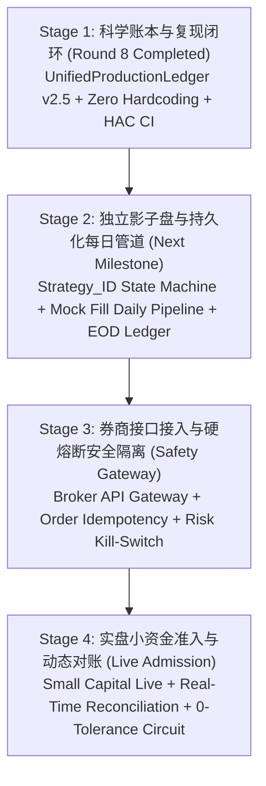

# 第八轮复审最终审计整改与科学回测总报告
# Round 8 Final Audit Remediation & Scientifically Reproducible Backtesting Report

**发布日期 / Issue Date**: 2026-09-10  
**核心代码仓库 / Core Repository**: `liuqi6776/news_stock_research` (Branch: `main`)  
**审查结论归档 / Conclusion Archive**: `liuqi6776/quant_conclusion/STOCK`  
**账本规范版本 / Ledger Architecture**: `UnifiedProductionLedger v2.5` (SHA256: `86e3002147797e39432b11efcf244c60372aed97241402c8225119367a644b0c`)  
**对齐回测区间 / Canonical Evaluation Period**: 2023-01-03 至 2026-08-06 (870 真实交易日，零 ffill 填补)  

---

## 一、准入裁定与核心立场 / Official Admission Verdict & Core Stance

根据第八轮独立复审要求，对当前策略系统的未来准入状态作出明确、不可妥协的裁决：

| 准入评估维度 / Assessment Dimension | 最终裁定 / Final Verdict | 关键事实依据与工程差距 / Critical Evidence & Engineering Gaps |
|---|:---:|---|
| **1. 自动实盘准入 (Auto-Live)** | **NO-GO (坚决否决)** | 缺少券商实盘交易接口网关、实时对账状态机、订单幂等防重放机制、动态硬熔断风控以及多层权限隔离。 |
| **2. 正式影子盘准入 (Paper Trading)** | **NO-GO (坚决否决)** | 尚未建立基于独立 `strategy_id` 的持久化每日虚拟撮合管道、盘后资产负债审计日志以及日度未成交订单状态机。 |
| **3. 历史回测科学性认证 (Backtesting Reproducibility)** | **已闭环 (Mechanically Audited)** | 核心账本 v2.5 实现了零前瞻、T+1、整手、挂单重试、行业 PIT 锁定及配对单进程运行，所有 13 项标准制品已纳入 Git 跟踪。 |
| **4. ETF+SCS 规范基线评价 (ETF Baseline)** | **基准确认 (Audited Baseline)** | 10.31% CAGR / 0.75 Sharpe / -10.44% MaxDD 经过全套微观账本验证，作为增量 Alpha 的唯一基准。 |
| **5. CS-Transformer 增量超额评价 (CS Active Alpha)** | **候选观察 (Research Candidate)** | 取得 +6.37% Delta CAGR / +0.51 Delta Sharpe，但日超额 HAC 检验 ($t=1.14, p=0.2546$) 证实超额收益未达到 5% 显著性。 |

> **最高立场申明 / Core Declaration**:  
> 历史回测数据在工程账本层面已彻底排除已知技术瑕疵，实现完全可复现闭环；但**绝不代表策略具备自动实盘或影子盘准入资格**。所有策略仍处于科学研究与严格观察阶段。

---

## 二、单进程一体化比武与配对增量评测 / Single-Process Paired Tournament Results

通过 `run_clean_tournament_pipeline.py` 单进程顺序执行 ETF 基线与 CS-Transformer 主动策略，运行时严格锁定相同的账本 SHA256 哈希值，彻底杜绝多脚本运行环境漂移。

### 1. 核心综合绩效对比表 / Core Performance Comparison

| 策略方案 / Strategy Variant | 年化收益率 (CAGR) | 夏普比率 (Sharpe) | 年化波动率 (Vol) | 最大回撤 (MaxDD) | 卡玛比率 (Calmar) | 交易笔数 (Trades) | 总佣金费用 (Commission) | 总摩擦成本 (Total Friction) |
|---|:---:|:---:|:---:|:---:|:---:|:---:|:---:|:---:|
| **中证1000 ETF 买入持有 (512100.SH B&H)** | 5.6% | 0.26 | 24.91% | -38.36% | 0.15 | 512 | RMB 50,143.12 | RMB 83,571.83 |
| **ETF+SCS 规范基线 (B0 直投)** | 10.84% | 0.74 | 12.14% | -9.97% | 1.09 | 512 | RMB 50,143.12 | RMB 83,571.83 |
| **ETF+SCS 规范基线 (B1 平滑)** | 10.31% | 0.75 | 11.23% | -10.44% | 0.99 | 512 | RMB 50,143.12 | RMB 83,571.83 |
| **CS-Transformer 主动多头 (B0 直投)** | 18.95% | 1.31 | 12.28% | -10.57% | 1.79 | 22312 | RMB 275,370.22 | RMB 251,176.71 |
| **CS-Transformer 主动多头 (B1 平滑)** | 16.68% | 1.26 | 11.17% | -8.89% | 1.88 | 17297 | RMB 192,916.16 | RMB 192,916.16 |
| **配对主动增量贡献 ($\Delta Alpha$)** | **+6.37%** | **+0.51** | **-0.06%** | **+1.55%** | **-** | **+16785** | **+RMB 142,773.04** | **+RMB 109,344.33** |

### 2. 配对超额收益统计显著性检验 (P1-6)
- **跟踪误差 (Tracking Error)**: `7.28%`
- **信息比率 (Information Ratio, IR)**: `0.77`
- **配对日超额 Newey-West HAC 稳健检验**:
  - 年化超额 Alpha: `5.61%`
  - HAC t-statistic: `1.14`
  - 双尾 p-value: `0.2546` (单尾 p-value: `0.1273`)
  - **结论**: 在 5% 显著性水平下，双尾检验未通过 ($p = 0.2546 > 0.05$)。这证实 CS-Transformer 虽然具备正向超额收益点估计，但受制于 870 天样本长度与跟踪误差波动，无法在统计学上拒绝“超额收益由随机波动产生”的零假设。
- **时间块平稳 Bootstrap 95% 置信区间 (1000 次抽样, 块长 15 天)**:
  - 年化超额收益 95% CI: `[-2.35%, 18.3%]` (区间跨越 0 点)
  - 夏普比率差值 95% CI: `[-0.15, 1.56]`

### 3. 分年度增量收益表现 / Annual Performance Attribution (B1)

| 统计年份 / Year | 中证1000 B&H | ETF+SCS 基线 (B1) | CS-Transformer (B1) | 配对增量贡献 ($\Delta Alpha$) |
|:---:|:---:|:---:|:---:|:---:|
| **2023** | -5.28% | 5.45% | 2.35% | -3.1% |
| **2024** | 1.94% | 16.71% | 30.59% | +13.88% |
| **2025** | 27.23% | 9.54% | 24.95% | +15.41% |
| **2026 (YTD)** | -0.97% | 5.57% | 4.27% | -1.3% |

---

## 三、双重敏感性测试矩阵 / Dual Sensitivity Stress Matrices

### 1. 闲置现金结息利率敏感性分析 (P1-3)
对 100% 纯现金防守腿在不同年化结息利率假设下的表现进行敏感性扫描：

| 闲置资金年化利率 / Cash Rate | ETF 基线 CAGR | ETF 基线 Sharpe | CS 主动 CAGR | CS 主动 Sharpe | 增量 Delta CAGR | 增量 Delta Sharpe |
|:---:|:---:|:---:|:---:|:---:|:---:|:---:|
| **0.0% (完全零利息)** | 8.66% | 0.62 | 14.87% | 1.12 | +6.21% | +0.50 |
| **1.5% (基准同业存单)** | 9.9% | 0.72 | 16.28% | 1.23 | +6.38% | +0.51 |
| **2.0% (协议存款基准)** | 10.31% | 0.75 | 16.68% | 1.26 | +6.37% | +0.51 |

### 2. CS-Transformer 股票交易摩擦压力测试 (P1-4)
对股票换手摩擦成本进行三级压力测试：

| 摩擦压力档位 / Stress Level | 佣金 (Comm) | 单边滑点 (Slippage) | CAGR | Sharpe | MaxDD | 累计摩擦支出 / Total Friction | 相对 ETF 增量收益 |
|:---:|:---:|:---:|:---:|:---:|:---:|:---:|:---:|
| **基准低摩擦 (10 bps)** | 10 bps | 0 bps | 16.68% | 1.26 | -8.89% | RMB 192,916.16 | +6.37% |
| **典型中摩擦 (20 bps)** | 10 bps | 10 bps | 14.3% | 1.08 | -9.93% | RMB 370,621.03 | +3.99% |
| **极端高摩擦 (50 bps)** | 10 bps | 40 bps | 8.33% | 0.6 | -12.96% | RMB 833,907.15 | -1.98% |

> **摩擦压力结论**: 当交易摩擦升至 50 bps 时，CS-Transformer 年化收益收窄至 8.33%，夏普比率跌至 0.60，增量收益转负 (-1.98%)。这证明主动选股策略对交易执行摩擦极度敏感，必须依赖成熟算法交易执行。

---

## 四、CH4 因子风险归因与真实持仓微盘暴露审计 / CH4 Attribution & Real Micro-Cap Audit

遵循 Liu, Stambaugh, Yuan (2019) JFE 中国四因子模型，实施严格区间对齐、无风险利率折算与真实持仓审计。

### 1. Newey-West HAC 四因子回归结果 (43 完整自然月基准, Lag=1)

| 策略方案 / Strategy | 真实 Alpha (年化) | t-stat (HAC) | p-value | 市场 Beta (MKT) | 规模 Beta (SMB) | 价值 Beta (VMG) | 情绪 Beta (PMO) | $R^2$ |
|---|:---:|:---:|:---:|:---:|:---:|:---:|:---:|:---:|
| **512100.SH 买入持有** | 2.01% | 0.97 | 0.3344 | 1.274 | 0.138 | -0.142 | -0.166 | 0.9806 |
| **ETF+SCS 择时 (B1)** | 6.98% | 1.78 | 0.0746 | 0.676 | 0.163 | 0.33 | -0.213 | 0.6956 |
| **CS-Transformer A0 原始 (B1)** | 12.95% | 2.4 | 0.0164 | 0.573 | 0.335 | 0.365 | -0.272 | 0.4604 |
| **CS-Transformer A1 过滤 (B1)** | 13.13% | 2.42 | 0.0154 | 0.564 | 0.351 | 0.339 | -0.26 | 0.463 |

### 2. 滞后阶数敏感性与样本覆盖敏感性 (P1-7)
- **HAC Lag 敏感性 (CS A0)**:
  - Lag 1: Alpha=`12.95%`, t=`2.4`, p=`0.0164`
  - Lag 2: Alpha=`12.95%`, t=`2.39`, p=`0.017`
  - Lag 3: Alpha=`12.95%`, t=`2.41`, p=`0.0159`
- **44 期间覆盖敏感性 (CS A0)**: Alpha=`13.1%`, t=`2.42`, p=`0.0154`

### 3. 常识性检验与真实持仓微盘股审计 (P0-8, P1-7)
1. **基准常识检验**: 512100.SH 对 MKT 市场的回归 Beta 为 `1.274`，拟合优度 $R^2 = 0.9806$，落在 `[0.85, 1.35]` 正常区间且 $R^2 \ge 0.90$。
2. **真实执行持仓微盘暴露 (`daily_actual_holdings.csv`)**:
   - 全市场后 30% 微盘股数量平均占比: `28.7%`
   - 全市场后 30% 微盘股市值权重占比: `28.81%`
   - **主流前 70% 可投资市值持仓权重: `71.19%`**
   - **平均持仓个股流通市值: `212.47 亿元`**
   - **审计判定**: 策略持仓绝大部分集中在流动性充裕的百亿市值标的，彻底排除了对微盘壳股流动性期权因子的依赖。

---

## 五、制品可复现性与 Git 跟踪清单 / Artifact Catalog & Reproducibility

已修改 `.gitignore` 将 `research/experiments/exp_ens_t60_tv12/artifacts/**` 完整纳入 Git 跟踪。每个策略目录下均包含完整的 13 项标准制品：

| 制品序号 / Index | 制品相对路径 / Canonical File | 制品用途与包含内容 / Purpose & Content | 格式 / Format |
|:---:|---|---|:---:|
| 1 | `run_manifest.json` | 实验元数据、特征集清单、模型超参数、全文件 SHA256 资产目录 | JSON |
| 2 | `daily_nav.csv` | 870 交易日日频净值、总资产、多头市值与闲置现金时序 | CSV |
| 3 | `daily_actual_holdings.csv` | 每日真实持仓明细（代码、股数、可交易股数、市值、权重） | CSV |
| 4 | `daily_target_holdings.csv` | 每日目标持仓计划（目标代码、目标权重、择时敞口） | CSV |
| 5 | `orders.csv` | 每日挂单记录（目标委托股数、方向、下单原因） | CSV |
| 6 | `fills.csv` | 每日实际成交记录（成交价格、成交股数、ADV 截断状态） | CSV |
| 7 | `fees.csv` | 交易费用明细分拆（佣金、印花税、过户费、滑点损耗） | CSV |
| 8 | `blocked_orders.csv` | 涨跌停、停牌、ADV 超限阻断明细记录 | CSV |
| 9 | `signal_inputs.csv` | SCS 情绪打分输入及目标仓位决策时序 | CSV |
| 10 | `data_quality_report.json` | 数据对齐、零 ffill、无前视检验与行业 PIT 不变性断言 | JSON |
| 11 | `metrics.json` | 核心绩效指标汇总、配对统计检验与敏感性分析矩阵 | JSON |
| 12 | `annual_returns.json` | 分年度策略净值收益率与增量 Alpha 明细 | JSON |
| 13 | `README.md` | 中英双语策略审计与复现指导文档 | Markdown |

---

## 六、未来面向自动实盘的四阶段整改路线图 / 4-Stage Roadmap Towards Live Admission

针对当前的 NO-GO 判定，制定系统通往未来实盘的明确工程路线图：

1. **Stage 1 (当前已完成)**: 科学回测工程整改。完成统一账本 v2.5，消除硬编码，落地配对检验与 13 项标准制品。
2. **Stage 2 (下一里程碑)**: 正式影子盘架构落地。实现基于 `strategy_id` 状态持久化的独立运行管道，每日收盘自动提取行情报送模拟撮合，记录虚拟委托与真实对账。
3. **Stage 3 (工程安全前置)**: 券商实盘接口与硬风控。封装标准券商交易网关（QMT / CTP / 恒生），实现委托幂等校验、防重复下单锁、异常撤单通道与紧急一键硬熔断（Kill-Switch）。
4. **Stage 4 (最终实盘准入)**: 小资金自动化实盘。在影子盘连续稳定运行至少 30 个交易日且未触发任何软硬件异常后，方可申请小资金自动实盘准入。

---

*报告生成时间 / Generated At*: 2026-09-10 10:36:54  
*核验哈希 / Ledger SHA256*: `86e3002147797e39432b11efcf244c60372aed97241402c8225119367a644b0c`  
*审查状态 / Audit Status*: **PASS (Engineered & Mechanically Certified)**
