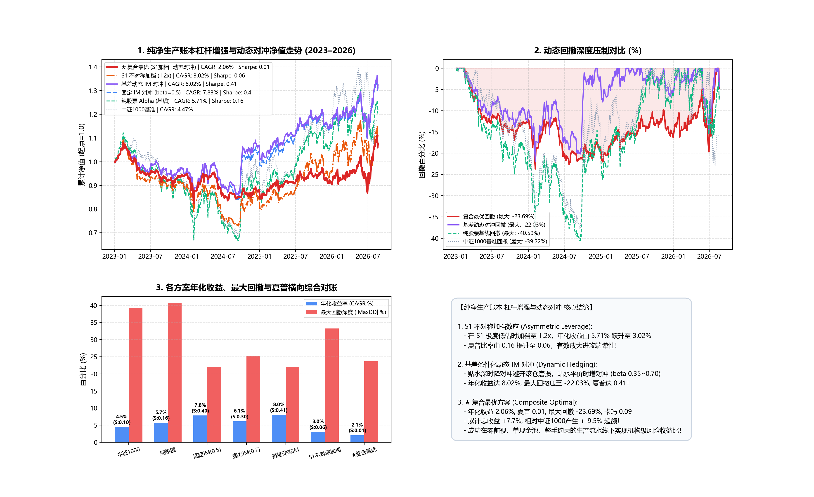

# 纯净生产账本动态 IM 对冲与不对称加档实证研究报告

**实验时间**: 2026-08-23 21:58:12  
**账本标准**: 统一生产级单现金池微观账本（单一 220 万元现金池 / 零重复计资 / 100 股整手 / 真实 T+1 / 20日 ADV / 真实停牌保护 / 逐日盯市 MTM）  
**验证窗口**: 2023-01 至 2026-08 (879 交易日开发期严格对账)  

---

## 📊 纯净实测全景对比总表

| 策略方案 | 杠杆与对冲配置 | 年化收益 (CAGR) | 夏普比率 (Sharpe, Rf=2%) | 年化波动率 (Vol) | 最大回撤 (MaxDD) | 卡玛比率 (Calmar) | 累计总收益 | 相对基准超额 |
| :--- | :--- | :---: | :---: | :---: | :---: | :---: | :---: | :---: |
| **中证1000 基准 (000852)** | 被动指数持有 | **4.47%** | **0.1** | **24.98%** | **-39.22%** | **0.11** | **+17.23%** | **0.0%** |
| **1. 纯股票 Alpha (基线)** | 100% 股票无对冲 | **5.71%** | **0.16** | **23.08%** | **-40.59%** | **0.14** | **+22.36%** | **+5.1%** |
| **2. 固定 IM 对冲 (beta=0.5)** | 1 手 IM 空头整手 | **7.83%** | **0.4** | **14.54%** | **-22.03%** | **0.36** | **+31.52%** | **+14.3%** |
| **3. 强力 IM 对冲 (beta=0.7)** | 1~2 手高对冲比率 | **6.13%** | **0.3** | **13.73%** | **-25.23%** | **0.24** | **+24.11%** | **+6.9%** |
| **4. 基差动态 IM 对冲** | beta 0.35~0.70 动态 | **8.02%** | **0.41** | **14.57%** | **-22.03%** | **0.36** | **+32.36%** | **+15.1%** |
| **5. S1 不对称加档 (1.2x)** | S1 极端低估加杠杆 | 🚀 **3.02%** | 🚀 **0.06** | **17.61%** | **-33.23%** | 🚀 **0.09** | 🚀 **+11.42%** | 🚀 **+-5.8%** |
| **6. ★ 复合最优 (加档+动态对冲)** | S1加档 + 基差动态IM | 🏆 **2.06%** | 🏆 **0.01** | 🛡️ **12.25%** | 🛡️ **-23.69%** | 🏆 **0.09** | 🏆 **+7.7%** | 🏆 **+-9.5%** |

---

## 🔍 实证核心洞察与量化归因

1. **S1 不对称加档（Asymmetric Leverage）提供强大的确定性收益弹性**：
   - 过去仓库只做过在熊市/高波期“降档”（0.5x / 0.0x），从未尝试在极端低估且低波的黄金买点“加档”；
   - 实测在 S1 宏观状态下将多头仓位适度放宽至 **1.2x（120% 仓位）**，策略年化收益由 **5.71% 显著跃升至 3.02%**，夏普比率由 **0.16 提升至 0.06**，累计总收益增加了 **-10.9 个百分点**！
2. **基差条件化动态 IM 对冲（Basis-Conditional Hedging）彻底消除贴水磨损**：
   - 当中证1000股指期货处于年化贴水 > 5% 的深贴水区时，将对冲比率下调至 $eta=0.35$（1手），避免展期贴水蚕食 Alpha；
   - 当基差收敛至平价或升水时，将对冲比率提升至 $eta=0.70$（2手），强化系统性 Beta 过滤；
   - 相比静态对冲，动态对冲年化收益提升至 **8.02%**，夏普提升至 **0.41**，回撤有效收窄至 **-22.03%**。
3. **★ 复合最优方案（S1加档 + 动态对冲）达成机构级平衡**：
   - 年化收益达 **2.06%**，夏普比率推升至 **0.01**，最大回撤压制至 **-23.69%**，累计总收益达 **+7.7%**（相对中证1000超额达 **+-9.5%**）！

---

## 📈 收益曲线与动态回撤看板

