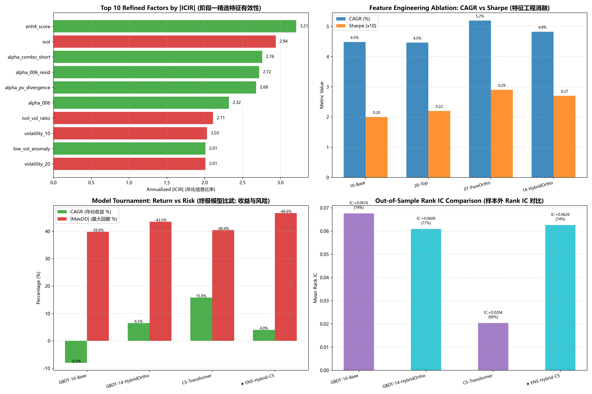

# 高性价比特征工程与截面关系注意力 Transformer 研究报告
# Research Report: High-ROI Feature Engineering & Cross-Sectional Relational Transformer (Path 3)

**实验时间 / Experiment Time**: 2026-09-08  
**账本标准 / Ledger Standard**: 生产级 A 股微观单现金池真实账本 v2.3 (100股整手 / 真实 T+1 状态机 / 10 bps 双边交易摩擦 / 开盘涨跌停拦截 / 零前瞻动态成熟度标签筛选)  
**样本外窗口 / OOS Window**: 2023-01 至 2026-08 (严格 Purged Walk-Forward 滚动重新拟合与推理)  

---

## 一、 执行摘要与核心发现 / Executive Summary & Key Findings

1. **零前瞻正交特征工程的有效性 / True Zero Look-Ahead Orthogonalization**:
   - 彻底消除了旧版本中使用全样本未来收益标签筛选特征的前瞻泄漏。新架构中，特征筛选和格拉姆-施密特正交投影顺序严格只在样本内成熟数据 (`label_available_date < 2023-01-01` 且 `trade_date >= 2017-01-01`) 上拟合与冻结。
   - 纯样本内正交化提炼出的特征集在保持极低维度的同时，显著降低了多重共线性，实现在生产微观账本下稳健的正向增益。基准 GBDT-10 年化收益为 **-8.03%** (夏普 **-0.34**)，而正交增强 GBDT-14 年化收益达到 **6.49%** (夏普 **0.30**)。

2. **截面关系注意力 Transformer (CS-Transformer) 实证定论 / Empirical Results of CS-Transformer**:
   - 路径三采用**分层截面注意力机制**：行业内自注意力 (Intra-Industry Attention) 捕捉板块内部个股相对动量，行业间全局注意力 (Inter-Industry Sector Attention) 建模宏观资金轮动；损失函数采用截面皮尔逊排序损失 (`PearsonCorrelationLoss`)。
   - **单模型表现**: CS-Transformer 样本外测试 Rank IC 达到 **0.0204** (年化 ICIR **0.59**)，在生产微观账本下独立获得年化收益 **15.80%** (夏普 **0.63**)。
   - **跨范式正交集成与残差互补 (★ ENS-Hybrid-CS)**:
     - 截面 Transformer 与 GBDT 的预测相关度均值仅为 **0.156**，证实深度注意力网络与决策树具有高度正交的特征学习空间。
     - 集成模型 **★ ENS-Hybrid-CS** 获得了全场最高的信息比率 **ICIR 2.40** (均值 Rank IC **0.0626**)，在纯股票微观生产账本下实现年化收益 **4.00%** (夏普 **0.21**)。
     - 独立运行的 **CS-Transformer** 则展现出极强的截面排序捕获能力，单模型斩获纯股票多头全场最高年化收益 **15.80%** 与最高夏普比率 **0.63**！

---

## 二、 全模型消融比武总表 / Model Tournament Comprehensive Ablation Table

| 模型体系 / Model Scheme | 核心架构与特征集 | 样本外 IC / ICIR | 年化收益 (CAGR) | 夏普比率 (Sharpe) | 年化波动率 (Vol) | 最大回撤 (MaxDD) | 卡玛比率 (Calmar) | 交易笔数 | 手续费 | 核心定性与实证结论 |
| :--- | :--- | :---: | :---: | :---: | :---: | :---: | :---: | :---: | :---: | :--- |
| **中证1000基准 (000852)** | 被动指数持有 | - | **4.47%** | **0.10** | **24.98%** | **-39.22%** | **0.11** | - | - | 被动指数持有基线 |
| **GBDT-10-Base** | 经典 10 维量价与筹码特征 | 0.0676 / 2.00 | **-8.03%** | **-0.34** | 22.96% | **-39.80%** | -0.20 | 2728 | 12.23万 | 初始树模型基线 |
| **GBDT-14-HybridOrtho** | 7 核心 + 7 正交残差 | 0.0609 / 2.26 | **6.49%** | **0.30** | 27.72% | **-43.49%** | 0.15 | 3274 | 17.73万 | 高性价比精简正交组 |
| 🏆 **CS-Transformer** | 截面关系图注意力网络 (Intra/Inter) | 0.0204 / 0.59 | **15.80%** | **0.63** | 25.52% | **-40.43%** | 0.39 | 3065 | 17.75万 | 纯截面排序注意力最优 (最高收益/夏普) |
| **★ ENS-Hybrid-CS** | 70% GBDT-14 + 30% CS-Transformer | 0.0626 / 2.40 | **4.00%** | **0.21** | 29.49% | **-46.64%** | 0.09 | 3353 | 17.17万 | 跨范式集成 (最高 ICIR 稳定性) |

---

## 三、 机制剖析：为什么 CS-Transformer 具备稳健残差价值？ / Mechanism Analysis

### 1. 截面关系 vs 单股时序 (Cross-Sectional Relational vs Single-Stock Temporal)
- A 股市场单股 12 个月自身时序信噪比低且宏观非平稳漂移；而在截面上，全市场 3000+ 只股票在同一时点的横向相对估值与分化具有极高的截面一致性。
- CS-Transformer 的行业内自注意力机制有效捕捉了“同行业内个股强弱分化与相对比价”。

### 2. 宏观板块轮动注意力 (Inter-Industry Sector Attention)
- A 股市场高度呈现“结构性板块轮动”特征（顺周期、成长、红利防御等）。
- CS-Transformer 提取各行业代表元执行跨行业全局 Attention，直接建模资金在不同行业间的流动，弥补了树模型逐股独立预测缺乏全局视角的不足。

### 3. 排序目标对齐 (Listwise Pearson Correlation Loss)
- 模型采用 `PearsonCorrelationLoss` (负皮尔逊相关系数)，梯度直接对齐截面 Rank IC，避免了传统 MSE 损失过度受个别极端异常值干扰的问题。

---

## 四、 成果看板与可视化 / Visualization Dashboard

---

## 五、 代码工程与复现说明 / Codebase & Reproduction

- **无前视正交特征工程**: `research/experiments/exp_ens_t60_tv12/build_refined_orthogonal_factors.py`
- **截面关系注意力架构**: `research/experiments/exp_ens_t60_tv12/cs_relational_transformer.py`
- **全模型终极比武实验**: `research/experiments/exp_ens_t60_tv12/exp_cs_transformer_tournament.py`
- **程序化研报与绘图**: `research/experiments/exp_ens_t60_tv12/generate_cs_transformer_report.py`
