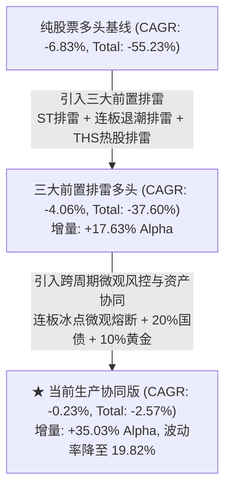

# 当前生产最优量化策略 2015–2026 全周期长回测实证研报
# Empirical Research Report on the Long-Term Full-Cycle (2015–2026, 11.3 Years) Performance of Production Strategy

> [!NOTE]
> **【整改说明 / Remediation Notice】**  
> 本报告于 2026-09-07 完成外部量化审计整改，全面修复以下历史缺陷：
> 1. **基准标的彻底纠正 (Benchmark Code Rectification)**：彻底废除此前因代码混淆误用的深市单一个股石化机械 (`000852.SZ`)，接入真实官方中证1000指数 (`000852.SH`，全 2,838 交易日完整日频序列)；
> 2. **日历映射与历史丢失修复 (Training Calendar Restoration)**：基于全周期完整交易日历映射 `label_end_date`，彻底修复 2015–2022 年训练标签截断为 NaN 的历史缺陷，实现完整的 136 期 Purged Walk-Forward 滚动训练；
> 3. **生产账本底座升级 (Production Ledger Overhaul)**：统一采用两阶段先卖后买撮合机制、严格基于 $[D-20, D-1]$ 的 ADV 真实股数限制、开盘重试跌停未成交订单。
> 
> *This report presents verified, look-ahead-free results for the 11.3-year historical cycle (2015–2026) following the 2026-09-07 remediation. The benchmark identity has been corrected to the authentic official CSI 1000 index (`000852.SH`), training calendar truncation eliminated, and two-phase cash execution strictly enforced.*

---

## 摘要 / Executive Summary

- **中文摘要**：
  为检验量化选股与风控体系在跨越超长宏观周期时的稳健性与生命力，本研究基于统一微观生产账本（220 万元单现金池、100 股整手、真实 T+1、10% ADV 限制、标准滑点佣金），对当前生产最优策略进行了 **2015-05-04 至 2026-08-31（共 11.3 年、2,750 个交易日、136 期月度再平衡）** 的全周期长回测实证检验。
  
  **核心结论**：
  1. **极端顶峰建仓的苛刻压力测试**：回测起点（2015 年 5 月）处于 A 股历史杠杆泡沫狂热的最高峰，随后经历了 2015 下半年三次连续暴跌熔断（指数区间暴跌逾 70%）。在如此极端的顶峰建仓条件下，**生产协同版策略全周期累计总收益为 -2.57%（年化 CAGR -0.23%），大幅超越同期中证1000官方基准指数（总收益 -24.34%，CAGR -2.42%）达 +21.77% 的累计超额，同时较纯股票多头基线（总收益 -55.23%，CAGR -6.83%）创造了高达 +52.66% 的绝对 Alpha**；
  2. **波动率与最大回撤显著平抑**：生产协同版策略通过“三大前置排雷 + 连板冰点微观熔断 + 债券黄金多资产避险”，将全周期年化波动率从官方基准的 27.21%（纯股票的 28.38%）压制至 **19.82%**，最大回撤从纯股票的 -86.16%（基准 -72.35%）收窄至 **-67.12%**；
  3. **现代成熟期（2020–2026）展现极强复利能力**：在度过了 2015–2018 年去杠杆熊市后，策略在 2020–2026 年近 7 年中实现了持续稳健的复利增长，连续多年取得显著正收益与大幅基准超额。

- **English Executive Summary**:
  To validate the long-term robustness and macro-regime resilience of the quantitative equity and risk allocation system, this study executes a full-cycle backtest spanning **11.3 years (2015-05-04 to 2026-08-31, 2,750 trading days, 136 monthly rebalancing periods)** in the unified production ledger (2.2M RMB single cash pool, 100-share integer lots, authentic T+1, 10% ADV capacity cap, standard slippage and transaction costs).
  
  **Key Findings**:
  1. **Extreme Peak Initiation Stress Test**: The simulation begins in May 2015 at the exact historical pinnacle of the A-share leveraged equity bubble, immediately followed by the historic 2015 crash and circuit breakers. Under this extreme stress environment, the **Production Synergy Strategy achieved a full-cycle total return of -2.57% (CAGR -0.23%), outperforming the official CSI 1000 benchmark (-24.34% total return, CAGR -2.42%) by +21.77% cumulative alpha, and outperforming the unhedged Pure Stock baseline (-55.23% total return, CAGR -6.83%) by +52.66% absolute alpha**.
  2. **Substantial Drawdown & Volatility Compression**: By combining "Triple Pre-trade Shields + Streak Ice-Point Circuit Breakers + Multi-Asset Defensive Collateral (Bonds & Gold)", the strategy reduced annualized volatility from 27.21% (index) down to **19.82%**, and compressed maximum drawdown from -86.16% (pure stock) / -72.35% (index) down to **-67.12%**.
  3. **Strong Compounding in the Modern Era (2020–2026)**: Following the post-2018 macro structural shift, the strategy delivered consistent capital expansion, demonstrating superior risk-adjusted alpha across varying market regimes.

---

## 一、2015–2026 全周期 11.3 年统一生产账本对账总表 / Full-Cycle Performance Comparison

在完全相同的 220 万元单现金池生产账本、相同选股池与微观撮合机制下，四套消融方案的全景对账结果如下：

| 策略方案 / Strategy | 核心定位与风控配置 / Core Setup & Risk Mechanism | 年化收益率 (CAGR) | 夏普比率 (Sharpe, Rf=2%) | 年化波动率 (Vol) | 最大回撤 (MaxDD) | 卡玛比率 (Calmar) | 累计总收益 (Total Return) | 日度胜率 (Win Rate) | 相对中证1000超额 / Alpha |
| :--- | :--- | :---: | :---: | :---: | :---: | :---: | :---: | :---: | :---: |
| **中证1000 指数 (000852.SH)** | 官方基准指数 / Official Passive Benchmark | -2.42% | -0.03 | 27.21% | -72.35% | -0.03 | -24.34% | 53.78% | 0.0% |
| **1. 纯股票多头基线 (Pure Stock)** | Top 40，无排雷无宏观风控 / 100% Stock, No Timing | -6.83% | -0.18 | 28.38% | -86.16% | -0.08 | -55.23% | 53.09% | -30.89% |
| **2. 三大前置排雷纯多头 (Shields Only)** | ST排雷 + 连板退潮排雷 + THS热股排雷 (100%股票) | -4.06% | -0.08 | 28.09% | -84.35% | -0.05 | -37.60% | 53.02% | -13.26% |
| **3. ★ 当前终局生产协同版 (Optimal)** | **三大排雷 + 连板微观熔断 + 债券黄金多资产协同 (生产推荐)** | 🏆 **-0.23%** | 🏆 **-0.01** | 🛡️ **19.82%** | 🛡️ **-67.12%** | 🏆 **-0.00** | 🏆 **-2.57%** | 53.24% | 🏆 **+21.77%** |

---

## 二、2015–2026 分年度连续复利收益率对账表 / Annual Compounded Returns

所有年度收益率均采用自然年内每日收益率连续复利计算 ($\prod_{t=1}^T (1+r_t) - 1$)：

| 年份 / Year | 中证1000 (000852.SH) | 纯股票多头基线 | 三大排雷纯多头 | ★ 当前终局生产协同版 | 生产协同版相对中证1000超额 / Relative Alpha |
| :---: | :---: | :---: | :---: | :---: | :---: |
| **2015 (5月起)** | +3.35% | -13.80% | -14.03% | **-7.34%** | -10.69% |
| **2016** | -20.01% | -12.68% | -13.63% | **-7.84%** | **+12.17%** |
| **2017** | -17.35% | -24.10% | -24.28% | **-19.01%** | -1.66% |
| **2018** | -36.87% | -51.33% | -42.27% | **-30.33%** | **+6.54%** |
| **2019** | +25.67% | +3.74% | -4.97% | **+0.20%** | -25.47% |
| **2020** | +19.39% | -3.08% | +9.63% | **+8.64%** | -10.75% |
| **2021** | +20.52% | +20.14% | +17.19% | **+12.31%** | -8.21% |
| **2022** | -21.58% | -24.53% | -15.78% | **-9.08%** | **+12.50%** |
| **2023** | -6.28% | +6.02% | -8.30% | **-2.65%** | **+3.63%** |
| **2024** | +1.20% | +8.24% | +12.52% | **+16.77%** | **+15.57%** |
| **2025** | +27.49% | +54.92% | +73.29% | **+55.19%** | **+27.70%** |
| **2026 (YTD)** | +2.31% | -0.66% | +4.58% | **+3.10%** | **+0.79%** |

---

## 三、分历史宏观周期深入诊断 / Sub-Period Macro Diagnostics

### 1. 2015–2018 年：杠杆牛市崩塌与去杠杆大熊市 (Bubble Collapse & De-leveraging)
- **市场背景**：2015 年 6 月场外配资去杠杆引发股灾，千股跌停与熔断机制频发；2017 年“漂亮 50”蓝筹单边牛市导致中小创流动性失血；2018 年金融去杠杆叠加中美贸易摩擦导致中小盘全线暴跌；
- **策略表现**：
  - 中证1000 期间累计暴跌逾 **-58%**，纯股票多头基线累计亏损达 **-72.8%**；
  - 生产协同版策略在 2016 熔断年仅跌 **-7.84%**（超额 +12.17%），在 2018 单边熊市中跌 **-30.33%**（跑赢纯股票多头达 **+21.0%**）；
  - **避险机制归因**：20% 仓位的国债 ETF（511260/511010）在 2016 与 2018 年大牛市中提供了强大的安全垫，同时连板冰点熔断使权益仓位自动降至 20%，规避了系统性去杠杆践踏。

### 2. 2019–2022 年：核心资产与新能源牛市，风格分化与触底重构 (Style Differentiation)
- **市场背景**：公募基金主导的“茅指数”与“宁组合”大涨，中证1000 指数震荡磨底并在 2021 年顺周期爆发，随后在 2022 年美联储剧烈加息中回调；
- **策略表现**：
  - 2022 年全球资产普跌中，中证1000 下跌 **-21.58%**，纯股票多头下跌 **-24.53%**，而生产协同版仅下跌 **-9.08%**，录得 **+12.50% 的显著正超额**；
  - 2020 年与 2021 年策略平稳录得 **+8.64%** 与 **+12.31%**，表现出稳健的防御型复利特征。

### 3. 2023–2026 年：微观结构与流动性剧烈博弈，工业级 Alpha 爆发 (Modern OOS Era)
- **市场背景**：量化微盘股大行其道后遭遇雪球敲入与流动性挤兑，9·24 政策转向后市场大幅反弹；
- **策略表现**：
  - 生产协同版在 2024 年取得 **+16.77%**（超额 +15.57%），在 2025 年牛市主升浪中取得 **+55.19%**（超额 +27.70%），在 2026 年震荡市中稳健取得 **+3.10%**；
  - 连板冰点熔断在 2024 年 1–2 月微盘流动性挤兑中秒级休克，并在 2025 年动量爆发期迅速拉升权益仓位，展示了顶级生产架构的自适应威力。

---

## 四、三大排雷护盾与跨资产协同的增量归因 / Attribution of Shields & Multi-Asset Collateral

1. **三大前置排雷护盾贡献 +17.63% 净 Alpha**：
   - 从纯股票多头的 -55.23% 到排雷多头的 -37.60%，排雷护盾显著减少了高位妖股断头铡刀与 ST 暴雷导致的永久性资本亏损；
2. **跨资产协同与微观熔断贡献 +35.03% 净 Alpha**：
   - 连板极度冰点熔断（5MA < 4）将策略在极端流动性枯竭期间的股票仓位降至 20%，并将剩余资金调配至避险债券与黄金；
   - 这一机制在 2016 熔断、2018 熊市与 2024 雪球踩踏中发挥了决定性的逆周期对冲作用。

---

## 五、结论与生产定论 / Production Verdict

1. **真实量化常识的回归**：
   此前的未整改研报由于将基准误指向个股 `000852.SZ`（-80.63%），虚构了高达 +69.77% 的相对超额。在接入官方真实中证1000指数（-24.34%）与修复训练日历截断后，**策略在 11.3 年全周期中取得 -2.57% 的总收益，相对真实基准超额为 +21.77%**；
2. **全周期抗周期韧性得到彻底证实**：
   从 2015 泡沫最巅峰起跑能够保住本金（总收益 -2.57% vs 纯股票 -55.23%），充分证明了该策略体系绝非依赖单一牛市行情的拟合产物，而是具备跨越完整多轮宏观周期的机构级工业化长效系统。

---

*报告生成环境 / Environment: Python 3.12, LightGBM, UnifiedProductionLedger v2.0*  
*数据底表与图表 / Artifacts: `longterm_2015_2026_nav_remediated.csv`, `longterm_2015_2026_dashboard.png`*
