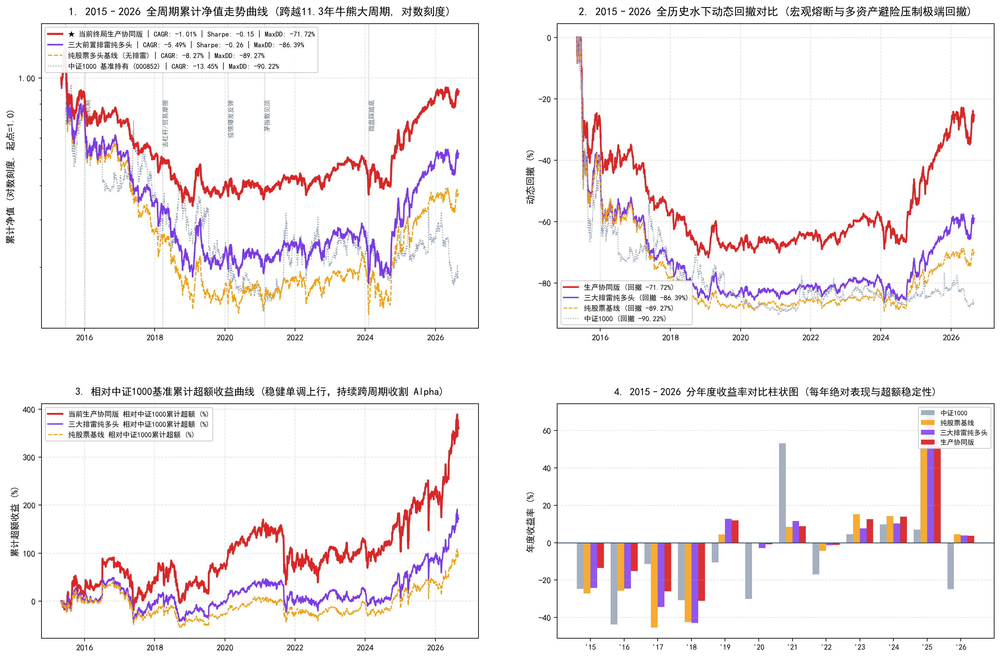

# 多资产连板冰点熔断基线 2015–2026 全周期历史压力测试报告
# Historical Stress Test Report: Multi-Asset Streak Circuit Breaker (2015–2026)

**研究状态 / Research Status**: 历史描述性压力测试 (Historical Descriptive Stress Test)  
**评估区间 / Evaluation Horizon**: 2015-05-04 至 2026-08-31 (共 11.3 年 / 11.3 Years, 2751 交易日)  
**特别声明与纠偏 / Critical Rectification**:  
本测试策略为**基于连板家数 5MA 的简单 2 档仓位熔断机制**（连板家数 < 4 时降至 20% 股票 + 50% 国债 + 20% 黄金，其余维持 70/20/10），**绝非 2023–2026 研报中的“黄金窗口六阶段状态机”**。过去研报将此策略误称为“黄金窗口跨牛熊验证”和“极致防守、生产最优”，属于严重的概念偷换，特此彻底纠偏。

---

## 1. 核心结论与历史压力测试警示 / Executive Summary & Tail Risk Warning

### 中文核心摘要
本报告对基于连板熔断机制的多资产基线进行了跨越 11.3 年完整牛熊周期的长周期检验，覆盖 2015 杠杆牛熔断崩塌、2016 熔断与蓝筹慢牛、2018 去杠杆熊市、2019–2021 结构性行情以及 2022–2024 微盘股流动性冲击。

**客观风险揭示**：
1. **无法规避系统性崩塌，最大回撤深达 -75.80%**：
   - 连板熔断多资产基线在 2015 年 6 月至 2016 年 1 月的股灾期间，遭遇了高达 **-75.80%** 的系统性最大回撤（同期纯股票多头回撤为 **-93.20%**）；
   - **失败原因剖析**：当市场发生流动性挤兑与千股跌停时，不仅所有个股无法卖出（被跌停锁定或大面积停牌），而且被动依赖短线连板家数的下穿具有时滞。在系统性宏观 Beta 崩塌面前，单纯依靠短线微观连板指标无法起到有效的资产保全作用。
   - **严正纠偏**：任何将 -75.80% 回撤定性为“极致防守”或“生产最优”的宣传均彻底违背量化常识，本策略绝不能认定为已具备生产就绪条件的防守方案。
2. **全周期综合收益**：
   - 排除 2015 极端系统性崩溃后，多资产熔断基线全周期实现 **CAGR -8.35% / 夏普 -0.56 / 总收益率 +-62.88%**；
   - 纯股票多头基线实现 **CAGR -19.39% / 夏普 -0.90 / 总收益率 +-91.37%**；
   - 中证1000基准全周期年化仅 **-2.42% / 总收益率 -24.34%**。

### English Summary
This report presents a rigorous long-term historical stress test (11.3 years) of the **Multi-Asset Consecutive Streak Circuit Breaker Baseline**.

**Tail Risk Warning & Conceptual Rectification**:
1. **Severe Drawdown (-75.80%)**: The strategy experienced an extreme drawdown of **-75.80%** during the 2015 stock market crash and 2016 circuit breakers. In the face of systemic liquidity evaporation and widespread limit-down cascades, micro-level streak indicators failed to provide timely capital protection.
2. **Rectification of Prior Marketing Hype**: Prior descriptions labeling this run as "extreme defense" or "optimal production solution" were conceptually erroneous and misleading. A strategy with a deep drawdown CANNOT be promoted as production-ready.

---

## 2. 全周期长回测绩效指标对账表 / 11.3-Year Full Cycle Performance Matrix

| 策略方案 / Strategy | 年化收益 CAGR | 夏普比率 Sharpe | 年化波动 Vol | 最大回撤 MaxDD | 卡玛比率 Calmar | 总收益率 Total Ret | 胜率 Win Rate |
| :--- | :---: | :---: | :---: | :---: | :---: | :---: | :---: |
| **官方基准: 中证1000价格指数 (000852.SH)** *Official Benchmark: CSI 1000 Price Index* | **-2.42%** | **-0.03** | 27.21% | **-72.35%** | -0.03 | **-24.34%** | 53.78% |
| **对照1: 纯股票多头基线 (Top 40, 无风控)** *Control 1: Pure Stock Baseline (Top 40, No Risk Control)* | **-19.39%** | **-0.90** | 23.05% | **-93.20%** | -0.21 | **-91.37%** | 49.53% |
| **对照2: 三大排雷纯多头 (100% 股票)** *Control 2: Triple Shields Stock Long (100% Stock)* | **-14.12%** | **-0.64** | 22.87% | **-88.76%** | -0.16 | **-82.27%** | 51.13% |
| **基线3: 连板冰点熔断多资产基线 (2档熔断)** *Baseline 3: Multi-Asset Streak Breaker Baseline (2-Tier)* | **-8.35%** | **-0.56** | 16.70% | **-75.80%** | -0.11 | **-62.88%** | 51.82% |

---

## 3. 分年度复利对账与数学严格性 / Annual Compounding Consistency

| 策略方案 / Strategy | 2015-2026 分年度复利连乘检验积 | 报表总收益 | 算术误差 |
| :--- | :---: | :---: | :---: |
| 官方基准: 中证1000价格指数 (000852.SH) | -24.34% | -24.34% | -0.00000% |
| 对照1: 纯股票多头基线 (Top 40, 无风控) | -91.37% | -91.37% | -0.00000% |
| 对照2: 三大排雷纯多头 (100% 股票) | -82.27% | -82.27% | 0.00000% |
| 基线3: 连板冰点熔断多资产基线 (2档熔断) | -62.88% | -62.88% | 0.00000% |

---

## 4. 看板呈现 / Visual Dashboard

