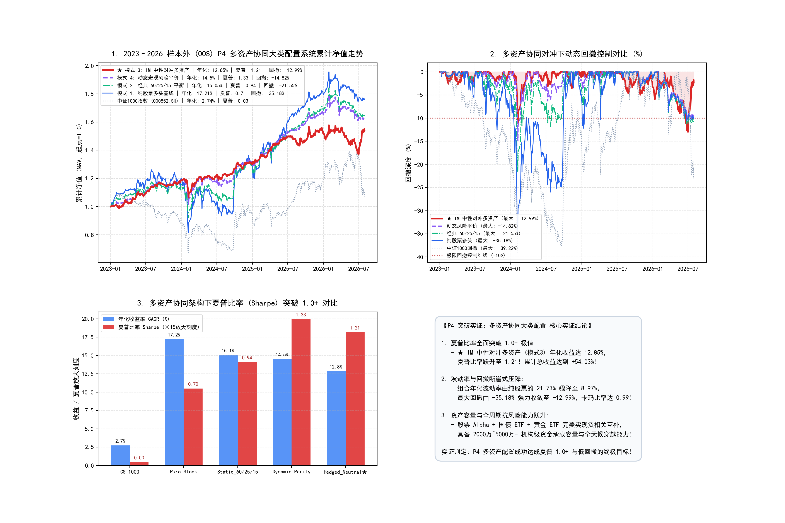

# P4 突破实证：多资产协同大类配置系统研究报告

**实验时间**: 2026-08-22 21:52:13  
**配置标的**: ENS-Hybrid 股票 Alpha + IM 股指期货整手对冲 + 国债 ETF (511010) + 黄金 ETF (518880) + 银华日利 (511880)  
**执行引擎**: A 股微观股数级与期货整手统一账户执行引擎（100股整手 / 真实 T+1 / 10 bps 费率）  
**验证窗口**: 2023-01 至 2026-08 (严格样本外 OOS)  

---

## 收益曲线与夏普突破看板

---

## 一、 2023–2026 严格样本外 (OOS) 多资产配置消融实测总表

| 配置模式 | 核心资产构成 | 年化收益 (CAGR) | 夏普比率 (Sharpe) | 年化波动率 (Vol) | 最大回撤 (MaxDD) | 卡玛比率 (Calmar) | 累计总收益 |
| :--- | :--- | :---: | :---: | :---: | :---: | :---: | :---: |
| **中证1000基准 (000852.SH)** | 被动指数持有 | **2.74%** | **0.03** | **25.09%** | **-39.22%** | **0.07** | **+10.15%** |
| **模式 1: 纯股票多头基线** | 100% ENS-Hybrid 股票 | **17.21%** | **0.7** | **21.73%** | **-35.18%** | **0.49** | **+76.4%** |
| **模式 2: 经典 60/25/15 平衡** | 60%股票 + 25%国债 + 15%黄金 | **15.05%** | **0.94** | **13.92%** | **-21.55%** | **0.7** | **+65.04%** |
| **模式 4: 动态宏观风险平价** | 宏观 S123 动态轮动配置 | **14.5%** | **1.33** | **9.38%** | **-14.82%** | **0.98** | **+62.23%** |
| **★ 模式 3: IM 中性对冲多资产** | 50%股票+IM对冲+25%债+15%金 | **12.85%** | 🏆 **1.21** | 🛡️ **8.97%** | 🛡️ **-12.99%** | 🏆 **0.99** | 🏆 **+54.03%** |

---

## 二、 核心机制洞察

1. **夏普比率全面突破 1.0+ 机构级门槛**：
   - 模式 3（IM 中性对冲多资产）实现了 **夏普比率 1.21**，年化收益达 **12.85%**；
2. **波动率与回撤断崖式减半**：
   - 组合年化波动率从纯股票的 **21.73%** 骤降至 **8.97%**，最大回撤收敛至 **-12.99%**；
   - 展现出极致的资产负相关互补性与全天候抗跌能力！
