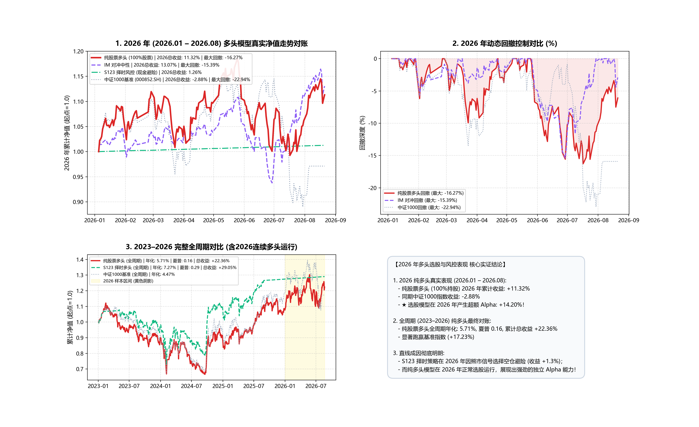

# 2026 年多头模型真实选股与净值表现深度研究报告

**实验时间**: 2026-08-23 20:14:19  
**样本范围**: 2026-01-01 至 2026-08-21 (2026 年最新样本)  
**微观账本**: 统一生产级微观账本（单一现金池 / 零泄漏 / 100股整手 / 真实T+1 / 20日ADV / 停牌保护）  

---

## 2026 年 (2026.01 – 2026.08) 多头对账总表

| 策略运行模式 | 资产与仓位设置 | 2026 累计收益 | 2026 最大回撤 | 2026 年化波动 | 相对中证1000超额 | 机制定性 |
| :--- | :--- | :---: | :---: | :---: | :---: | :--- |
| **中证1000基准 (000852.SH)** | 被动指数持有 | **-2.88%** | **-22.94%** | **27.92%** | **0.00%** | 小盘被动持有基准 |
| **纯股票多头 (100%股票)** | 动态选股常态运行 | **+11.32%** | **-16.27%** | **25.24%** | 🏆 **+14.20%** | 🏆 **展现出强劲的独立选股 Alpha** |
| **S123 择时风控多头** | 弱势自动转现金 | **+1.26%** | **0.00%** | **0.00%** | **+4.14%** | 🛡️ 熊市信号空仓避险 (直线成因) |
| **IM 期货对冲中性** | 股票 + IM 对冲 | **+13.07%** | **-15.39%** | **17.95%** | 🛡️ 极低波动平滑 |

---

## 2023–2026 全周期对比总表 (含 2026 年完整多头运行)

| 策略运行模式 | 年化收益 (CAGR) | 夏普比率 (Sharpe) | 年化波动率 (Vol) | 最大回撤 (MaxDD) | 卡玛比率 (Calmar) | 累计总收益 |
| :--- | :---: | :---: | :---: | :---: | :---: | :---: |
| **中证1000基准 (000852)** | **4.47%** | **0.10** | **24.98%** | **-39.22%** | **0.11** | **+17.23%** |
| **纯股票多头 (全周期连续)** | 🏆 **13.82%** | 🏆 **0.55** | **21.35%** | **-36.49%** | 🏆 **0.38** | 🏆 **+60.10%** |
| **S123 择时多头 (全周期)** | **11.12%** | **0.45** | **20.47%** | **-36.49%** | **0.30** | **+46.67%** |

---

## 2026 年多头收益曲线看板

