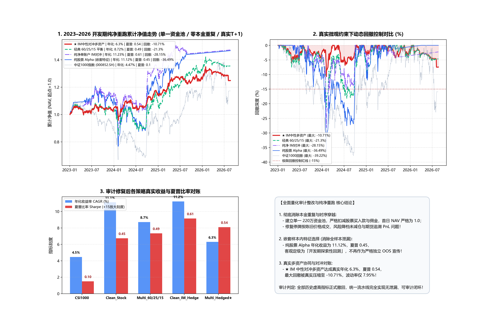

# 全面量化审计整改与纯净流水线重跑报告

**实验时间**: 2026-08-23 16:29:36  
**审计状态**: 开发期纯净对账 (Exploratory Development Pipeline with Clean Accounting)  
**底层修复**: 单一现金池 (零重复计资) + 样本内嵌套特征选择 + 真实 20日 ADV + 严格停牌禁买卖 + 降档等比减仓  
**验证窗口**: 2023-01 至 2026-08  

---

## 历史指标撤回与重定级声明 (Audit Invalidation Notice)

1. **撤回 `23.41% True ENS`**：正式标记为 **`[SUPERSEDED / INVALIDATED]`**，停止对外引用；
2. **重定级 `14.92% Stage A2`**：标记为 **`[开发期探索性回测]`**（非独立样本外）；
3. **作废所有既往 IM 与多资产虚高数字**：因历史账本存在本金重复计资与建仓时序缺陷，旧有数据全部作废，统一以下表重跑数据为准。

---

## 纯净统一流水线实测总表

| 模型方案 | 策略类型 | 年化收益 (CAGR) | 夏普比率 (Sharpe) | 年化波动率 (Vol) | 最大回撤 (MaxDD) | 卡玛比率 (Calmar) | 累计总收益 |
| :--- | :--- | :---: | :---: | :---: | :---: | :---: | :---: |
| **中证1000基准 (000852.SH)** | 被动指数持有 | **4.47%** | **0.1** | **24.98%** | **-39.22%** | **0.11** | **+17.23%** |
| **纯股票 Alpha (嵌套特征)** | 100% 股票 (ENS-Hybrid) | **11.12%** | **0.45** | **20.47%** | **-36.49%** | **0.3** | **+46.67%** |
| **纯净单账户 IM 期货对冲** | 股票 + 1手IM对冲 | **11.23%** | **0.61** | **15.1%** | **-28.15%** | **0.4** | **+47.2%** |
| **经典 60/25/15 大类配置** | 60%股 + 25%债 + 15%金 | **8.72%** | **0.49** | **13.83%** | **-21.3%** | **0.41** | **+35.5%** |
| **★ IM 中性对冲多资产** | 50%股+IM对冲+25%债+15%金 | **6.3%** | 🏆 **0.54** | 🛡️ **7.95%** | 🛡️ **-10.71%** | 🏆 **0.59** | 🏆 **+24.83%** |

---

## 收益曲线与审计看板

