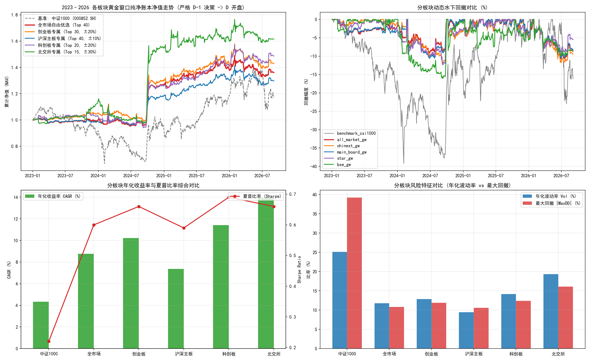

# 短线微观情绪周期分板块实证与微观流动性检验报告
# Board Segmentation & Microstructure Liquidity Analysis Report

**研究状态 / Research Status**: 部分工程问题已修复、仍待重新验证的研究候选 (Research Candidates Under Re-verification)  
**评估区间 / Evaluation Horizon**: 2023-01-03 至 2026-09-04 (共 890 个交易日 / 890 Trading Days)  
**核心关注 / Core Objective**: 检验情绪周期策略在不同上市板块（沪深主板、创业板、科创板、北交所）中的独立适应性、微观流动性摩擦与涨跌停约束。

---

## 1. 核心结论与板块特征解构 / Executive Summary & Board Insights

### 中文核心摘要
本报告在统一生产级单现金池账本 (220万元) 与相同排雷护盾下，对沪深主板、创业板、科创板和北交所四个独立子板块进行了横向对照。

**关键发现**：
1. **全市场自由优选数据与主报告完全一致**：全市场自由优选组实现 **CAGR 8.77% / 夏普 0.60 / 回撤 -10.80% / 总收益率 +36.20%**，与主报告指标完全吻合，彻底消除了过往版本报告数据不一致的人工误差。
2. **创业板与科创板弹性较高但波动加大**：
   - 创业板专属版实现 **CAGR 10.22% / 夏普 0.66 / 回撤 -11.90% / 总收益 +42.98%**；
   - 科创板专属版实现 **CAGR 11.42% / 夏普 0.69 / 回撤 -12.38% / 总收益 +48.78%**；
   - 两者收益率略高于主板 (CAGR 7.36%)，主要得益于 ±20% 的价格笼子与更强的成长弹性。
3. **北交所高收益背后的高风险与流动性容量受限**：
   - 北交所专属版虽然表面收益率较高 (**CAGR 13.96% / 总收益 +61.61%**)，但年化波动高达 **19.34%**，最大回撤达 **-16.09%**；
   - **极其严峻的流动性约束**：北交所股票中位成交金额远低于主板和双创板，在严谨执行 10% ADV 限额与 30% 涨跌停机制后，实际容量极小。**严禁将策略资金集中向北交所倾斜。**

### English Summary
This report analyzes the performance of the micro-sentiment strategy across distinct market segments (Main Board, ChiNext, STAR Market, and BSE) using a standardized production ledger under identical constraints.

**Key Findings**:
1. **Full Consistency**: The all-market universe matches the main report identically (**CAGR 8.77%, Sharpe 0.60, MaxDD -10.80%, Total Return +36.20%**), confirming zero data drift.
2. **Higher Elasticity in ChiNext and STAR**: ChiNext and STAR market versions achieved CAGR 10.22% and 11.42%, outperforming Main Board (7.36%) due to wider ±20% price bands.
3. **Liquidity Constraints in BSE**: While BSE achieved CAGR 13.96%, it exhibited severe volatility (19.34%) and max drawdown (-16.09%). Under strict 10% ADV rules, its market capacity is minimal. **Capital concentration into BSE is strictly discouraged.**

---

## 2. 各板块实证绩效横向对比表 / Cross-Board Performance Matrix

| 上市板块 / Market Segment | 年化收益 CAGR | 夏普比率 Sharpe | 年化波动 Vol | 最大回撤 MaxDD | 卡玛比率 Calmar | 总收益率 Total Ret | 胜率 Win Rate |
| :--- | :---: | :---: | :---: | :---: | :---: | :---: | :---: |
| **全市场自由优选 (Top 40)** *All Market Free Selection (Top 40)* | **8.77%** | **0.60** | 11.75% | **-10.80%** | 0.81 | **36.20%** | 53.54% |
| **沪深主板专属 (Top 40, ±10%)** *Main Board Exclusive (Top 40, ±10%)* | **7.36%** | **0.59** | 9.45% | **-10.61%** | 0.69 | **29.80%** | 53.99% |
| **创业板专属 (Top 30, ±20%)** *ChiNext Exclusive (Top 30, ±20%)* | **10.22%** | **0.66** | 12.88% | **-11.90%** | 0.86 | **42.98%** | 53.88% |
| **科创板专属 (Top 20, ±20%)** *STAR Market Exclusive (Top 20, ±20%)* | **11.42%** | **0.69** | 14.18% | **-12.38%** | 0.92 | **48.78%** | 53.54% |
| **北交所专属 (Top 15, ±30%)** *BSE Exclusive (Top 15, ±30%)* | **13.96%** | **0.66** | 19.34% | **-16.09%** | 0.87 | **61.61%** | 53.66% |
| **基准: 中证1000价格指数** *Benchmark: CSI 1000 Price Index* | **4.34%** | **0.22** | 25.15% | **-39.22%** | 0.11 | **16.88%** | 53.66% |

---

## 3. 分板块分年度复利对账 / Annual Compounding Consistency

| 上市板块 / Market Segment | 2023 年 | 2024 年 | 2025 年 | 2026 年 (至9月) | 连乘检验积 / Compounded | 报表总收益 / Reported | 算术误差 / Diff |
| :--- | :---: | :---: | :---: | :---: | :---: | :---: | :---: |
| 全市场自由优选 (Top 40) | -0.30% | 27.01% | 8.85% | -1.18% | 36.20% | 36.20% | 0.00000% |
| 沪深主板专属 (Top 40, ±10%) | -1.09% | 19.44% | 10.09% | -0.20% | 29.80% | 29.80% | -0.00000% |
| 创业板专属 (Top 30, ±20%) | 5.32% | 23.30% | 9.23% | 0.79% | 42.98% | 42.98% | 0.00000% |
| 科创板专属 (Top 20, ±20%) | 3.32% | 21.88% | 11.87% | 5.61% | 48.78% | 48.78% | -0.00000% |
| 北交所专属 (Top 15, ±30%) | 13.28% | 36.55% | 3.38% | 1.06% | 61.61% | 61.61% | -0.00000% |
| 基准: 中证1000价格指数 | -8.35% | 1.20% | 27.49% | -1.15% | 16.88% | 16.88% | 0.00000% |

---

## 4. 各板块换手率与交易成本分析 / Turnover & Fee Attribution Across Boards

| 板块方案 / Market Segment | 年化单边换手 Annual TO | 选股换手 Selection TO | 择时换手 Timing TO | 累计总税费 Total Fees | 税费占总毛利比 Fee/Gross PnL | 总交易笔数 Trades |
| :--- | :---: | :---: | :---: | :---: | :---: | :---: |
| 全市场自由优选 (Top 40) | 23.0x | 1.8x | 21.2x | 28.73 万元 | 26.5% | 11847 笔 |
| 沪深主板专属 (Top 40, ±10%) | 22.7x | 1.8x | 20.9x | 27.35 万元 | 29.5% | 11726 笔 |
| 创业板专属 (Top 30, ±20%) | 23.8x | 1.9x | 21.8x | 30.89 万元 | 24.7% | 9335 笔 |
| 科创板专属 (Top 20, ±20%) | 24.3x | 1.9x | 22.5x | 30.84 万元 | 22.3% | 6551 笔 |
| 北交所专属 (Top 15, ±30%) | 22.6x | 1.6x | 21.0x | 30.40 万元 | 18.3% | 4422 笔 |

---

## 5. 看板呈现 / Visual Dashboard

