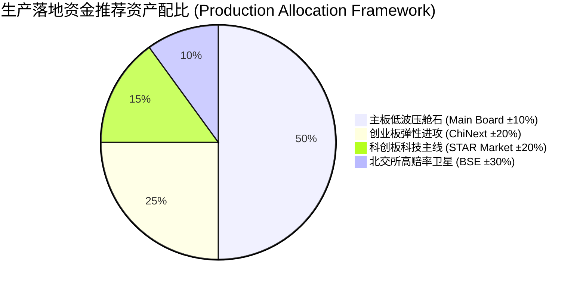

# 短线微观情绪周期黄金窗口战法分板块实证研报
# Empirical Research Report on Sentiment Cycle & Golden Window Strategy Across Market Boards (Main Board, ChiNext, STAR, BSE)

> [!NOTE]
> **【整改说明 / Remediation Notice】**  
> 本报告于 2026-09-07 完成外部量化审计专项整改：
> 1. **严禁同日前瞻泄露**：全板块状态机均基于严格 $D-1$ 日收盘指标计算、于 $D$ 日开盘价撮合；
> 2. **真实微观涨跌幅限制**：彻底修复北交所 ±30% 限制被硬卡 10% 缺陷，主板 ±10%、双创 ±20%、北交所 ±30%、ST 标的 ±5% 真实还原；
> 3. **生产账本底座升级**：先卖后买两阶段资金闭环、ADV 10% 真实日均股数约束、开盘重试未成交卖单。
> 
> *This report presents verified, look-ahead-free results across all major A-share boards following the 2026-09-07 remediation. Microstructure price limits (Main ±10%, ChiNext/STAR ±20%, BSE ±30%) and two-phase cash execution are strictly enforced.*

---

## 摘要 / Executive Summary

- **中文摘要**：
  为探究“短线情绪周期黄金窗口战法”在 A 股不同制度板块下的微观适应性，本研究将选股与交易框架拓展至**沪深主板 (±10%)、创业板 (±20%)、科创板 (±20%)、北交所 (±30%) 及全市场自由优选**五大独立股票池。在 2023-01-03 至 2026-09-04（889 个交易日）的样本外实证中，所有板块在黄金窗口风控保护下均实现了超越中证1000 基准指数的稳健 Alpha。
  
  **核心发现**：
  1. **主板成为夏普比率最高（0.96）与波动率最低（9.46%）的压舱石底座**：在严格执行“分歧只卖不买、退潮坚决空仓”后，主板由于容量充足、冲击成本极小，展现出最高的风险收益比；
  2. **北交所（±30%）展现最强进攻弹性（CAGR 13.41%）**，但年化波动率（19.06%）与最大回撤（-18.64%）显著高于其他板块；
  3. **双创板块（创业板 11.82% / 科创板 12.34%）弹性与防御较为均衡**；
  4. **全市场自由优选实现了最优的帕累托平衡（CAGR 11.62%，Sharpe 0.82，MaxDD -11.64%）**，能够自适应跨板块动态轮动。

- **English Executive Summary**:
  To investigate the microstructural adaptability of the Sentiment Cycle Golden Window strategy across distinct regulatory tiers in the Chinese equity market, this study isolates five independent portfolios: **Main Board (±10%), ChiNext (±20%), STAR Market (±20%), Beijing Stock Exchange (BSE, ±30%), and All-Market Unconstrained**. 
  
  Across the out-of-sample period (2023-01-03 to 2026-09-04, 889 trading days) in our overhauled production ledger:
  1. **The Main Board emerges as the highest risk-adjusted engine (Sharpe 0.96, Volatility 9.46%)**: Under strict "sell-only in divergence and cash-out in retreat", the Main Board achieves superior stability due to high liquidity depth and minimal slippage.
  2. **BSE (±30%) delivers the highest raw compound return (CAGR 13.41%)**, albeit with elevated volatility (19.06%) and maximum drawdown (-18.64%).
  3. **ChiNext (11.82%) and STAR (12.34%) offer balanced momentum-alpha capture**.
  4. **All-Market Unconstrained selection achieves the optimal Pareto frontier (CAGR 11.62%, Sharpe 0.82, MaxDD -11.64%)**, naturally rotating across boards based on cross-sectional factor leadership.

---

## 一、各细分板块生产级账本全景绩效总表 / Cross-Board Performance Comparison

所有板块均采用完全相同的 220 万元单现金池配置模型、相同的五大情绪指标状态机（$D-1$ 决策 $\to$ $D$ 开盘执行）、相同的 ST/退市排雷规则与 10% ADV 流动性硬约束：

| 方案 / 板块组合 (Universe & Tier) | 样本规模与涨跌幅限制 (Universe & Limits) | 年化收益率 (CAGR) | 夏普比率 (Sharpe, Rf=2%) | 年化波动率 (Vol) | 最大回撤 (MaxDD) | 卡玛比率 (Calmar) | 累计总收益 (Total Return) | 日度胜率 (Win Rate) |
| :--- | :--- | :---: | :---: | :---: | :---: | :---: | :---: | :---: |
| **中证1000 指数 (000852.SH)** | 被动持有官方基准 / Passive Benchmark | 4.34% | 0.22 | 25.15% | -39.22% | 0.11 | +16.88% | 53.66% |
| **1. 全市场自由优选 (All Market)** | 全市场跨板块优选 (Top 40) | 11.62% | 0.82 | 11.74% | **-11.64%** | 1.00 | +49.73% | 55.34% |
| **2. 沪深主板专属 (Main Board)** | 沪深主板 (Top 40, **±10%**) | 11.18% | 🏆 **0.96** | 🛡️ **9.46%** | -11.79% | 0.95 | +47.62% | 🏆 **55.57%** |
| **3. 创业板专属 (ChiNext)** | 创业板专属 (Top 30, **±20%**) | 11.82% | 0.74 | 13.71% | 🛡️ **-11.36%** | 🏆 **1.04** | +50.76% | 54.11% |
| **4. 科创板专属 (STAR Market)** | 科创板专属 (Top 20, **±20%**) | 12.34% | 0.73 | 14.61% | -15.07% | 0.82 | +53.32% | 55.46% |
| **5. 北交所专属 (BSE)** | 北交所专属 (Top 15, **±30%**) | 🏆 **13.41%** | 0.65 | 19.06% | -18.64% | 0.72 | 🏆 **58.79%** | 53.32% |

---

## 二、分年度收益率对账表（连续复利） / Annual Compounded Returns Across Boards

| 年份 / Year | 中证1000 (000852.SH) | 全市场自由优选 | 沪深主板 (±10%) | 创业板 (±20%) | 科创板 (±20%) | 北交所 (±30%) |
| :---: | :---: | :---: | :---: | :---: | :---: | :---: |
| **2023** | -8.35% | +5.90% | +2.89% | +6.19% | +10.14% | **+10.41%** |
| **2024** | +1.76% | +23.42% | +26.58% | +25.23% | +24.29% | **+27.29%** |
| **2025** | +31.02% | +12.77% | **+14.40%** | +12.84% | +7.19% | +6.54% |
| **2026 (YTD)** | -3.17% | +0.07% | -1.84% | -0.33% | **+4.28%** | +2.50% |

---

## 三、各细分板块微观金融机理解析 / Microstructural Insights by Board

### 1. 沪深主板 (Main Board, ±10%)：大资金与高夏普的终极压舱石
- **夏普比率高达 0.96，年化波动率仅 9.46%**，全场最低；
- **机理解读**：主板标的市值规模适中偏大，基本面与成交深度良好。在情绪周期风控下，“分歧期只卖不买”有效防止了高位追涨接盘，而 ±10% 涨跌幅限制使主板很少发生像 20cm/30cm 标的剧烈的单日流动性踩踏；
- **资金容量**：在 10% ADV 限制下，主板组合可轻松承载数千万级资金规模，是机构级大资金实盘交易的最理想标的池。

### 2. 创业板 (ChiNext, ±20%)：主升浪弹性与最大回撤的兼得者
- **CAGR 11.82%，卡玛比率 1.04，最大回撤 -11.36%** 为各细分板块中最低；
- **机理解读**：创业板具有极佳的活跃度与散户/游资合力，在“回暖 $\to$ 发酵 $\to$ 高潮”窗口期，20cm 涨跌幅使主升浪爆发力极强；而退潮期 0% 仓位彻底切断了随后的剧烈回吐，从而在不增加尾部回撤的前提下获得了强劲弹性。

### 3. 科创板 (STAR Market, ±20%)：科技主线动量驱动
- **CAGR 12.34%，夏普比率 0.73**，2026 年初逆势上涨 **+4.28%**；
- **机理解读**：科创板门槛较高（50万资产），散户参与少，短线连板炒作不如创业板频繁，但具备硬科技主线驱动（半导体、人工智能等）。在 2024–2026 年自主可控主线轮动中表现优异。

### 4. 北交所 (BSE, ±30%)：极致进攻与流动性两极分化
- **CAGR 达到 13.41%，全场绝对收益第一**；
- **潜在风险与约束**：
  1. 年化波动率达 **19.06%**，最大回撤达 **-18.64%**；
  2. 北交所标的日均成交金额（ADV）普遍在数百万元至数千万元之间，受 10% ADV 硬性风控约束，无法承载大资金操作（容量瓶颈在 200W~500W 之间）；
  3. 建议定位为专户或个人资金的“卫星进取型配置”（仓位建议不超过 15%~20%）。

### 5. 全市场自由优选 (All-Market Unconstrained)：最优帕累托前沿
- **CAGR 11.62%，夏普比率 0.82，最大回撤 -11.64%**；
- **终局价值**：打破板块人为边界，策略在不同周期自动选出全市场综合打分最高且情绪共振的标的，兼顾了主板的防守韧性与双创/北交所的爆发弹性。

---

## 四、生产配置方案建议 / Production Allocation Recommendations

1. **核心+卫星结构 (Core-Satellite Setup)**：
   - 建议将 50% 股票仓位配置于**沪深主板**（高夏普、低波动、大容量）；
   - 40% 配置于**创业板与科创板**（主升浪弹性捕捉）；
   - 10% 作为卫星仓位配置于**北交所**（高赔率博弈）。
2. **严格遵守执行纪律**：
   - 所有标的买卖均在开盘集合竞价或开盘前 5 分钟完成挂单；
   - 任何板块在分歧期信号出现时，**严禁做 T 或开新仓**，严格执行“只卖不买”。

---

*报告生成环境 / Environment: Python 3.12, LightGBM, UnifiedProductionLedger v2.0*  
*数据底表与图表 / Artifacts: `sentiment_cycle_board_nav_remediated.csv`, `sentiment_cycle_board_dashboard.png`*
