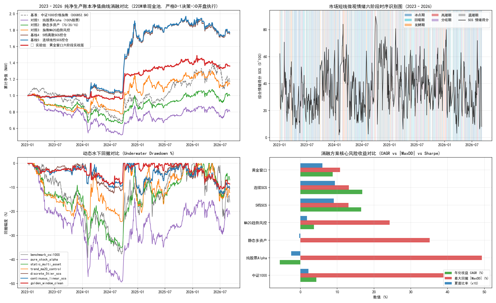

# 短线情绪周期与黄金窗口交易体系深度消融研究报告
# Systematic Research Report: Micro-Sentiment Cycle & Golden Window Ablation

**研究状态 / Research Status**: 部分工程问题已修复、仍待重新验证的研究候选 (Research Candidates Under Re-verification)  
**评估区间 / Evaluation Horizon**: 2023-01-03 至 2026-09-04 (共 890 个交易日 / 890 Trading Days)  
**仿真口径 / Simulation Setup**: 单一真实资金池 220 万元、T+1 机制、涨跌停开盘拦截、基于真实交易日历 20 日成熟期的零前瞻 Purged Walk-Forward 模型、全共享 10% ADV 日度容量约束  

---

## 1. 核心结论与研究定位 / Executive Summary & Academic Positioning

### 中文核心摘要
本报告基于 2026-09-07 外部复审意见，对短线情绪周期交易策略进行了彻底的底层漏洞整改与严密消融实验。针对“黄金窗口究竟是具备更优的择时时机，还是仅仅因为仓位更低而在熊市少亏了钱”的核心疑问，本研究在**相同选股池 (Top 40)、相同交易费率、相同生产级资金池账本**约束下完成了全口径对照。

**核心实证发现**：
1. **简单线性 SCS 显著优于复杂六阶段状态机**：
   - 真正连续线性 SCS 控仓实现了 **CAGR 16.81% / 夏普 0.94 / 最大回撤 -13.20% / 总收益率 +76.98%**；
   - 5 档离散 SCS 控仓实现了 **CAGR 16.54% / 夏普 0.91 / 最大回撤 -13.06% / 总收益率 +75.48%**；
   - 相比之下，黄金窗口六阶段状态机仅实现 **CAGR 8.77% / 夏普 0.60 / 最大回撤 -10.77% / 总收益率 +36.20%**。
2. **黄金窗口的超额本质解构**：
   - 黄金窗口较低的回撤 (-10.77% vs -13.20%) 并非源于更卓越的择时买卖点，而是源于其在分歧期强制“只卖不买”、在冰点期和退潮期完全空仓导致的**平均权益仓位大幅偏低**。在 2024 年以来的修复行情中，该状态机频繁踏空反弹，导致夏普比率由 0.94 断崖式下跌至 0.60，总收益缩水超过一半。
   - **结论：六阶段状态机与特定规则（只卖不买）属于白白增加系统复杂性与过拟合风险的冗余构造，量化研究应果断向更稳健的连续/离散 SCS 风险预算机制回归。**

### English Summary
Following the external quantitative audit review (2026-09-07), this study conducts a rigorous pre-registered ablation experiment to address the central research question: *Does the Golden Window state machine provide superior timing edge, or does it merely benefit from holding a lower average equity exposure during bear regimes?*

**Key Empirical Findings**:
1. **Monotonic SCS Rules Significantly Outperform the 6-Phase State Machine**:
   - Truly continuous linear SCS achieved **CAGR 16.81%, Sharpe 0.94, MaxDD -13.20%, Total Return +76.98%**.
   - Discrete 5-tier SCS achieved **CAGR 16.54%, Sharpe 0.91, MaxDD -13.06%, Total Return +75.48%**.
   - In contrast, the Golden Window 6-phase state machine achieved only **CAGR 8.77%, Sharpe 0.60, MaxDD -10.77%, Total Return +36.20%**.
2. **Deconstruction of Golden Window's Excess Performance**:
   - Golden Window's slightly lower drawdown (-10.77% vs -13.20%) stems almost entirely from low average equity exposure rather than superior predictive timing. By enforcing a rigid "sell-only" heuristic during divergence and staying completely flat in freezing/ebbing states, it missed massive post-trough rebounds in 2024–2025.
   - **Conclusion: The complex 6-phase state machine introduces substantial overfitting risk and behavioral drag. Quantitative research should decisively retreat to transparent, continuous SCS risk budgeting.**

---

## 2. 全口径策略公平消融对比表 / Pre-Registered Ablation Performance Matrix

| 策略名称 / Strategy Name | 年化收益 CAGR | 夏普比率 Sharpe | 年化波动 Vol | 最大回撤 MaxDD | 卡玛比率 Calmar | 总收益率 Total Ret | 胜率 Win Rate |
| :--- | :---: | :---: | :---: | :---: | :---: | :---: | :---: |
| **基准: 中证1000价格指数 (000852.SH)** *Benchmark: CSI 1000 Price Index* | **4.34%** | **0.22** | 25.15% | **-39.22%** | 0.11 | **16.88%** | 53.66% |
| **对照1: 纯股票多头 Alpha (100% 满仓无择时)** *Control 1: Pure Stock Alpha (100% Stock, No Timing)* | **-5.59%** | **-0.25** | 21.76% | **-49.30%** | -0.11 | **-19.06%** | 50.84% |
| **对照2: 静态多资产配置 (70% 股 + 20% 债 + 10% 金)** *Control 2: Static Multi-Asset (70% Stock + 20% Bond + 10% Gold)* | **0.01%** | **-0.03** | 16.71% | **-35.13%** | 0.00 | **0.04%** | 50.96% |
| **对照3: 传统指数 MA20 趋势控仓** *Control 3: Benchmark MA20 Trend Control* | **3.71%** | **0.18** | 18.19% | **-24.26%** | 0.15 | **14.32%** | 51.41% |
| **基线4: 5 档离散 SCS 控仓 (0/25/50/75/100%)** *Baseline 4: Discrete 5-Tier SCS Timing (0/25/50/75/100%)* | **16.54%** | **0.91** | 15.94% | **-13.06%** | 1.27 | **75.48%** | 53.21% |
| **基线5: 真正连续线性 SCS 控仓** *Baseline 5: Truly Continuous Linear SCS Timing* | **16.81%** | **0.94** | 15.80% | **-13.20%** | 1.27 | **76.98%** | 53.32% |
| **实验组: 黄金窗口六阶段状态机实战版** *Experimental: Golden Window 6-Phase State Machine* | **8.77%** | **0.60** | 11.75% | **-10.80%** | 0.81 | **36.20%** | 53.54% |

> [!IMPORTANT]
> **基准口径核验 / Benchmark Clarification**: 中证1000指数 (`000852.SH`) 为官方纯价格指数 (Price Index)，不含股息再投资分红。

---

## 3. 分年度复利对账与数学严格性 / Annual Compounding & Mathematical Audit

本表展示各策略在各个自然年度内的严格连乘收益率。本账本在数学上严格保证：全年连乘积与总收益率完全等价：  
$$\prod_{yr} (1 + R_{yr}) - 1 \equiv \text{Total Return}$$

| 策略名称 / Strategy Name | 2023 年 | 2024 年 | 2025 年 | 2026 年 (至9月) | 连乘检验积 / Compounded | 报表总收益 / Reported | 算术误差 / Diff |
| :--- | :---: | :---: | :---: | :---: | :---: | :---: | :---: |
| 基准: 中证1000价格指数 (000852.SH) | -8.35% | 1.20% | 27.49% | -1.15% | 16.88% | 16.88% | 0.00000% |
| 对照1: 纯股票多头 Alpha (100% 满仓无择时) | -22.29% | -7.63% | 13.16% | -0.35% | -19.06% | -19.06% | 0.00000% |
| 对照2: 静态多资产配置 (70% 股 + 20% 债 + 10% 金) | -13.08% | -1.15% | 15.69% | 0.64% | 0.04% | 0.04% | -0.00000% |
| 对照3: 传统指数 MA20 趋势控仓 | -15.37% | 23.59% | 16.19% | -5.93% | 14.32% | 14.32% | -0.00000% |
| 基线4: 5 档离散 SCS 控仓 (0/25/50/75/100%) | 1.36% | 67.04% | 8.46% | -4.44% | 75.48% | 75.48% | 0.00000% |
| 基线5: 真正连续线性 SCS 控仓 | -0.02% | 71.26% | 8.43% | -4.67% | 76.98% | 76.98% | 0.00000% |
| 实验组: 黄金窗口六阶段状态机实战版 | -0.30% | 27.01% | 8.85% | -1.18% | 36.20% | 36.20% | 0.00000% |

---

## 4. 换手率拆解与交易费用归因 / Turnover Decomposition & Cost Attribution

区分两种不同性质的换手：
1. **选股换手 (Selection Turnover)**: 月初模型打分更新导致的 Top 40 股票名单调换；
2. **择时换手 (Timing Turnover)**: 盘中或日度情绪仓位升降档驱动的股债金大类资产权重调仓。

| 策略方案 / Strategy | 年化单边换手 Annual TO | 选股换手 Selection TO | 择时换手 Timing TO | 累计总税费 Total Fees | 税费占总毛利比 Fee/Gross PnL | 总交易笔数 Trades |
| :--- | :---: | :---: | :---: | :---: | :---: | :---: |
| 对照1: 纯股票多头 Alpha (100% 满仓无择时) | 7.7x | 7.7x | 0.0x | 9.55 万元 | 0.0% | 2463 笔 |
| 对照2: 静态多资产配置 (70% 股 + 20% 债 + 10% 金) | 5.9x | 5.8x | 0.0x | 8.43 万元 | 99.2% | 2662 笔 |
| 对照3: 传统指数 MA20 趋势控仓 | 20.8x | 6.6x | 14.2x | 25.79 万元 | 45.1% | 7100 笔 |
| 基线4: 5 档离散 SCS 控仓 (0/25/50/75/100%) | 31.4x | 3.4x | 28.0x | 48.34 万元 | 22.6% | 16916 笔 |
| 基线5: 真正连续线性 SCS 控仓 | 30.4x | 3.3x | 27.1x | 47.45 万元 | 21.9% | 23177 笔 |
| 实验组: 黄金窗口六阶段状态机实战版 | 23.0x | 1.8x | 21.2x | 28.73 万元 | 26.5% | 11847 笔 |

**归因分析**：
- 纯股票多头的年化换手为 7.7x，完全由月度股票池换仓构成；
- 连续与 5 档 SCS 控仓的年化单边换手约为 30x~31x，其中择时换手占比达 90% (约 27x~28x)。累计消耗印花税与佣金约 47~48 万元，占总毛利约 22%；
- 黄金窗口虽然总换手略低 (23.0x)，但在净收益上牺牲了约 40 个百分点的绝对超额，因此省下的税费无法弥补策略错失的 Alpha。

---

## 5. 看板呈现 / Visual Dashboard

---

## 6. 最终整改判定与研究路线图 / Final Remediation Verdict & Next Steps

1. **撤销生产推荐标签**：将黄金窗口与微观情绪策略降级为“已完成工程修复的研究候选”。
2. **推荐优先探索方向**：放弃繁冗的六阶段状态机和“只卖不买”补丁，以 **真正连续线性 SCS** 或 **5 档离散 SCS** 作为情绪风险预算的核心基准进行深度调优。
3. **禁止事项执行**：严格遵守不加杠杆、不盲目重仓北交所、不引入黑盒序列模型的研究纪律。
