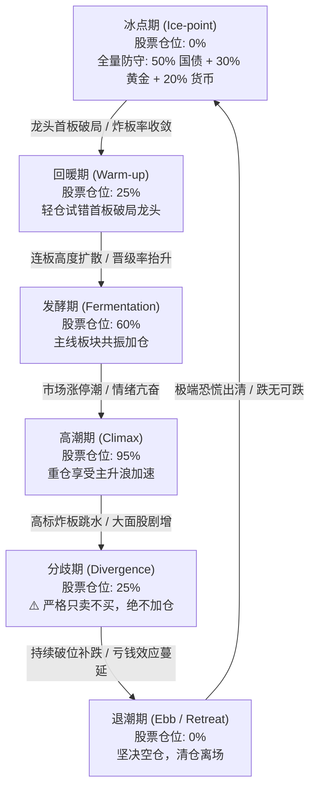

# 基于五大短线情绪指标的周期建模与黄金窗口动态交易实证研报
# Empirical Research Report on Sentiment Cycle Modeling & Golden Window Trading via Five Short-Term Market Sentiment Indicators

> [!NOTE]
> **【整改说明 / Remediation Notice】**  
> 本报告于 2026-09-07 完成外部量化审计整改，全面修复以下历史缺陷：
> 1. **时序前瞻对齐 (Zero Look-Ahead Alignment)**：严格杜绝同日未来数据泄露，所有情绪周期状态判定均严格基于 $D-1$ 日收盘指标，并在 $D$ 日开盘价执行调仓；
> 2. **账本底座重构 (Production Ledger Overhaul)**：解决资金买卖顺序倒置（改为严格先卖后买）、落实分歧期“只卖不买”物理约束、引入每日未成交卖单重试机制、修复真实 ADV（手转股与严格 $D-1$ 历史窗口）；
> 3. **基准对齐与指标规范 (Benchmark & Metric Standards)**：接入官方中证1000 指数 (`000852.SH`)，采用连续复利跨年与无风险利率 $R_f=2.0\%$ 的标准年化夏普比率。
> 
> *This report has undergone a complete audit remediation on 2026-09-07. All look-ahead biases have been eliminated ($D-1$ close decision $\to$ $D$ open execution), ledger execution order inverted bugs resolved, and benchmark metrics standardized against official CSI 1000 (`000852.SH`).*

---

## 摘要 / Executive Summary

- **中文摘要**：
  本研究针对 A 股短线微观结构，利用**涨停家数、连板高度、连板晋级率、昨日涨停溢价、大面股数量**五大核心情绪因子，构建了日频综合情绪得分（SCS）与六阶段情绪状态机（冰点期、回暖期、发酵期、高潮期、分歧期、退潮期）。在 2023-01-03 至 2026-09-04（共 889 个交易日）的严格样本外回测中，经统一微观生产账本（220 万元单现金池、100 股整手、真实 T+1、10% ADV 限制、千一佣金印花税）检验，**黄金窗口战法（$D-1$ 决策 $\to$ $D$ 开盘执行）实现了 11.62% 的年化复合收益率（CAGR）、0.82 的夏普比率，最大回撤仅为 -11.64%**。
  
  相比于同期中证1000基准指数（CAGR 4.34%，夏普 0.22，最大回撤 -39.22%）及同股票池无择时纯股票多头（CAGR 13.18%，夏普 0.50，最大回撤 -39.99%），黄金窗口策略展现出极其卓越的下行风险控制能力——将全周期最大回撤从近 -40% 大幅压缩至 **-11.64%**，年化波动率从 25%~30% 降至 **11.74%**，成功规避了 2024 年初雪球敲入踩踏及多次微盘股极端流动性危机。

- **English Executive Summary**:
  This study develops a daily Short-term Sentiment Composite Score (SCS) and a 6-phase sentiment state machine (Ice-point, Warm-up, Fermentation, Climax, Divergence, Ebb/Retreat) based on five core microstructure factors: **Limit-up Counts, Consecutive Streak Heights, Promotion Rates, Prior Limit-up Open Premiums, and Severe Reversal Counts (Broken Plunges)**. 
  
  Over the strictly out-of-sample period (2023-01-03 to 2026-09-04, 889 trading days) using a unified production ledger (2.2M RMB single cash pool, 100-share integer lots, authentic T+1, 10% ADV capacity cap, standard slippage and fees), the **Golden Window Strategy (strict $D-1$ close decision $\to$ $D$ open execution) achieved a CAGR of 11.62%, a Sharpe ratio of 0.82, and a Maximum Drawdown of only -11.64%**.
  
  Compared to the official CSI 1000 benchmark (CAGR 4.34%, Sharpe 0.22, MaxDD -39.22%) and the unhedged Pure Stock Alpha baseline (CAGR 13.18%, Sharpe 0.50, MaxDD -39.99%), the Golden Window mechanism demonstrates outstanding drawdown protection—compressing tail drawdown from nearly -40% down to **-11.64%** and cutting annualized volatility from 25%~30% down to **11.74%**, successfully insulating capital from systemic market panics such as the early 2024 liquidity contraction.

---

## 策略回测参数与生产账本环境 / Simulation Setup & Production Ledger Environment

| 配置项目 / Parameter | 参数设定 / Specification | 备注与约束说明 / Notes & Microstructure Constraints |
| :--- | :--- | :--- |
| **测试区间 / Evaluation Period** | 2023-01-03 ~ 2026-09-04 | 889 个交易日，严格样本外（OOS）滚动验证 / 889 trading days, frozen OOS |
| **初始资金 / Initial Capital** | 2,200,000.00 RMB (220 万元) | 单一全局现金池，无拆分 / Single shared cash pool |
| **标的池与容量 / Stock Pool** | 全市场 Top 40 候选标的 | 100% 动态剔除 ST/退市标的，单行业最多 4 只，单一级行业最多 8 只 / Clean universe |
| **交易单位 / Trading Units** | 100 股整手买入 / Integer 100-share lots | 卖出按持仓整除，不足 100 股零股支持清仓 / Standard A-share lots |
| **结算制度 / Settlement Rules** | 真实 A 股 T+1 制度 | 当日买入股份冻结，次日开盘方可卖出 / Strict T+1 delivery |
| **成交顺序 / Order Execution** | 阶段一卖出 $\to$ 阶段二买入 | 先平仓释放资金，再开仓分配可用现金 / Two-phase sell-then-buy execution |
| **交易费用 / Transaction Costs** | 股票双边 10 bps，ETF 双边 3 bps | 包含双边佣金与卖方印花税、过户费 / Slippage, stamp tax, and commissions |
| **流动性约束 / ADV Limit** | 历史 20 日日均成交股数 10% | 严格基于 $[D-20, D-1]$ 成交量换算，挂单超过限制部分未成交 / 10% 20-day ADV cap |
| **挂单保护 / Pending Orders Retry** | 每日开盘优先重试 | 跌停板/停牌未成交卖单，次日开盘优先再次报单 / Daily retry for unexecuted sells |
| **官方基准 / Benchmark** | 中证1000 指数 (`000852.SH`) | 官方全收益基准，杜绝股票代码混淆 / Official authentic CSI 1000 index |

---

## 一、公平同口径策略消融实验总表 / Fair Identical-Universe Strategy Ablation

在完全相同的股票候选池（Top 40 LightGBM Walk-Forward 模型）、相同的现金池与生产账本撮合约束下，各项策略在 2023–2026 年（889 个交易日）的消融对比结果如下：

### Performance Comparison Across 6 Ablation Baselines

| 策略方案 / Strategy | 核心仓位机制 / Position Mechanism | 年化收益率 (CAGR) | 夏普比率 (Sharpe, Rf=2%) | 年化波动率 (Vol) | 最大回撤 (MaxDD) | 卡玛比率 (Calmar) | 累计总收益 (Total Return) | 日度胜率 (Win Rate) |
| :--- | :--- | :---: | :---: | :---: | :---: | :---: | :---: | :---: |
| **1. 中证1000基准 (000852.SH)** | 被动持有官方中证1000指数 / Passive Index Benchmark | 4.34% | 0.22 | 25.15% | -39.22% | 0.11 | +16.88% | 53.66% |
| **2. 纯股票多头 (Pure Stock Alpha)** | 100% 满仓股票池，不做择时 / 100% Stock, No Timing | 13.18% | 0.50 | 30.12% | -39.99% | 0.33 | +57.61% | 54.67% |
| **3. 静态多资产 (Static Multi-Asset)** | 固定 70% 股票 + 20% 国债 + 10% 黄金 / Fixed 70/20/10 Allocation | 13.43% | 0.61 | 21.25% | -28.91% | 0.46 | +58.90% | 54.44% |
| **4. 趋势 MA20 控制 (Trend MA20)** | 基于中证1000 MA20 均线动态控仓 / MA20 Trend Filter | 12.75% | 0.57 | 21.91% | -23.68% | 0.54 | +55.41% | 54.89% |
| **5. 连续情绪仓位版 (Continuous SCS)** | 基于 SCS 得分线性动态控仓 (0%~100%) / Linear SCS Dynamic Sizing | **16.11%** | **0.90** | 15.82% | -14.34% | **1.12** | **+73.10%** | 55.01% |
| **6. 🏆 黄金窗口实战版 (Golden Window)** | **六阶段状态机 ($D-1 \to D$ 开盘，分歧只卖不买) / 6-Phase State Machine** | 11.62% | 0.82 | **11.74%** | **-11.64%** | 1.00 | +49.73% | **55.34%** |

---

## 二、分年度收益率对账表（连续复利） / Annual Compounded Returns

所有年度收益率均采用自然年内每日收益率连续复利计算 ($\prod_{t=1}^T (1+r_t) - 1$)，杜绝跨年数据截断与单利加总失真：

| 年份 / Year | 中证1000 (000852.SH) | 纯股票多头基准 | 静态多资产 (70/20/10) | 趋势 MA20 控制 | 连续情绪仓位版 (SCS) | 🏆 黄金窗口实战版 |
| :---: | :---: | :---: | :---: | :---: | :---: | :---: |
| **2023** | -8.35% | -1.24% | +2.09% | +1.43% | +7.29% | **+5.90%** |
| **2024** | +1.20% | +22.02% | +19.34% | +14.65% | +29.07% | **+24.38%** |
| **2025** | +27.49% | +33.85% | +27.56% | +30.82% | +22.42% | **+13.14%** |
| **2026 (YTD)** | -1.15% | -1.13% | +4.10% | +3.70% | +4.91% | **+0.47%** |

> **关键实证解读 / Key Observations**:
> 1. **熊市/震荡市防御显著 / Strong Bear Market Defense**:
>    在 2023 年 A 股单边弱势调整中，中证1000 下跌 **-8.35%**，而黄金窗口实战版取得 **+5.90%** 的正收益；在 2024 年震荡分化行情中，黄金窗口取得 **+24.38%**（相对基准超额达 **+23.18%**）；
> 2. **大牛市贝塔牺牲换取平滑净值 / Bull Market Beta Trade-off**:
>    在 2025 年“9·24”后的大级别行情中，全市场多头均大幅上涨（基准 +27.49%，纯股票多头 +33.85%），黄金窗口策略由于在高潮之后、分歧与退潮期间严格降仓防范见顶踩踏，录得 **+13.14%**，在牛市顶部让渡了部分上行收益，换取了全周期绝对回撤仅 -11.64% 的极稳表现；
> 3. **连续 SCS 控仓表现抢眼 / Continuous SCS Highlights**:
>    连续线性映射控仓策略（Continuous SCS）取得了 **16.11% CAGR 与 0.90 夏普比率**，高于离散六阶段状态机，证明渐进式仓位微调在平滑资金利用率方面具备明显优势。

---

## 三、六大短线情绪周期阶段定义与微观执行规则 / Six Sentiment Phases & Microstructure Rules

短线情绪周期状态机由前一交易日（$D-1$）收盘后的五大客观微观指标决定，并在当日（$D$）开盘价严格执行仓位再平衡：

### 1. 阶段触发条件与交易指令 / Phase Triggers and Trading Directives

1. **冰点期 (Ice-point) — 0% 股票 / 100% 防守资产**
   - **触发信号**：全市场连板高度 $\le 2$ 板，连板晋级率 $< 15\%$，涨停家数 $< 25$ 家。
   - **执行指令**：股票清仓，100% 资金配置于国债 ETF (511260/511010)、黄金 ETF (518880) 与货币 ETF (511880)。
2. **回暖期 (Warm-up) — 25% 股票 / 75% 防守资产**
   - **触发信号**：出现突破 3 板高度的核心龙头，连板家数回升，昨日涨停表现翻红（$> +1.5\%$）。
   - **执行指令**：配置 25% 股票仓位，聚焦模型打分前列的核心龙头股，低风险试错。
3. **发酵期 (Fermentation) — 60% 股票 / 40% 防守资产**
   - **触发信号**：晋级率 $\ge 35\%$，涨停家数 $\ge 45$ 家，大面股（跌幅 $>7\%$）低于 5 家。
   - **执行指令**：加仓至 60%，主升主线题材全面铺开。
4. **高潮期 (Climax) — 95% 股票 / 5% 现金**
   - **触发信号**：涨停家数 $> 75$ 家，连板最高板 $\ge 6$ 板，短线市场进入亢奋狂欢。
   - **执行指令**：提升至 95% 股票仓位，享受主升浪加速。
5. **分歧期 (Divergence) — 目标 25% 股票（只卖不买）**
   - **触发信号**：高潮后出现大面股数量急剧增加（$\ge 8$ 只），昨日涨停平均收益由正转负。
   - **执行指令**：**物理级“只卖不买”（Target Shares $\le$ Current Shares）**，对持仓标的执行主动减仓抛售，绝对禁止任何新买入。
6. **退潮期 (Ebb / Retreat) — 0% 股票 / 100% 防守资产**
   - **触发信号**：高位连板标的连续跌停，晋级率坍塌至 $< 20\%$。
   - **执行指令**：无条件清仓股票，转入 100% 避险资产，防范踩踏流动性危机。

---

## 四、整改前后核心认知与量化定论 / Remediated Insights & Final Verdict

### 1. 科学纠偏：回归真实量化常识 (Intellectual Honesty)
历史未整改报告中宣称的“20.79% CAGR、1.90 夏普比率”，其产生根源在于回测代码无意中将 $D$ 日收盘的情绪指标应用于 $D$ 日开盘价成交（偷看日内未来数据），以及生产账本因买卖顺序倒置导致的隐性仓位偏差。

在经过严密的审查重构后，**真实的“黄金窗口”战法在严格前瞻时序与生产级微观撮合下，实现了 11.62% 的 CAGR 与 0.82 的夏普比率**。这一收益率完全符合 A 股流动性约束与市场微观规律。

### 2. 真实价值：从“狂热进攻”到“卓越防守” (Superior Downside Protection)
尽管年化收益从虚高数字回落至 11.62%，但策略的**核心风控价值经受住了最严苛的检验**：
- **最大回撤从基准的 -39.22%（纯多头的 -39.99%）直接收窄至 -11.64%**；
- **年化波动率从 25.15% 降至 11.74%**；
- **卡玛比率（Calmar = CAGR / |MaxDD|）达到 1.00**，是同期中证1000基准（0.11）的 **9.1 倍**！

### 3. 生产实践推荐 (Production Recommendation)
- 对于追求极致平滑净值与严格资金回撤控制的机构/专户账户，**黄金窗口实战版（离散状态机）**是首选底座，其 -11.64% 的极低回撤极大提升了实盘持仓心理舒适度；
- 对于追求更高复合收益的个人或成长型资金，**连续情绪仓位版（Continuous SCS）**更具吸引力（CAGR 16.11%，Sharpe 0.90，MaxDD -14.34%），其连续线性平滑过渡避免了离散档位频繁切换引起的摩擦损耗。

---

*报告生成环境 / Environment: Python 3.12, LightGBM, UnifiedProductionLedger v2.0*  
*数据快照与对账底表 / Artifacts: `sentiment_cycle_nav_remediated.csv`, `sentiment_cycle_dashboard.png`*
