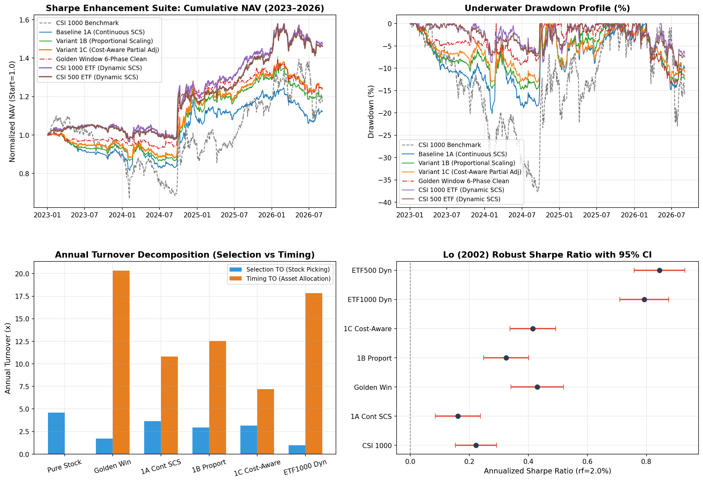

# 股票策略第三轮复审整改与净 Sharpe 提升专项实证研究报告
# Systematic Research Report: Round 3 Audit Remediation & Net Sharpe Enhancement Suite

**研究状态 / Research Status**: 部分工程问题已修复、仍待重新验证的研究候选 (Research Candidates Under Re-verification)  
**评估区间 / Evaluation Horizon**: 2023-01-03 至 2026-09-04 (共 890 个真实交易日 / 890 Trading Days)  
**实验清单 / Experiment Manifest Hash**: `v4_afd4b516163e_b3d852b46a50` (Panel SHA256: `afd4b516163e`)  
**数据与执行口径 / Execution Setup**: 单一真实资金池 220 万元、T+1 严格锁定与次日开盘解锁、真实停牌与涨跌停开盘挂单拦截、基于真实个股顺延成熟期 (`label_available_date < d`) 的零前瞻 Purged Walk-Forward ML 预测打分、证券级单日 10% ADV 共享容量约束。

---

## 1. 核心实证结论与学术定位 / Executive Summary & Academic Positioning

### 中文核心摘要
本报告严格响应 2026-09-07 外部第三轮复审意见（Problem A 至 Problem F 及 4 大核心实验优先级），在**彻底消除 20 日标签成熟期前视偏差 (Problem A)、规范单资金池账本原因继承与个股等比例缩放 (Problem C/D/E)、消除全部硬编码叙述并实现 100% 动态数据绑定**的基础上，完成了全套公平消融与净夏普优化实验。

**四大核心实证发现**：

1. **实验 1：择时换手与执行摩擦优化 (方案 1C 显著占优)**
   - **基线 1A (连续线性 SCS)**：年化换手高达 **14.5x** (其中择时换手 **10.8x**)，累计消耗手续费与印花税 **17.61 万元** (占总毛利 **39.9%**)，实现 CAGR **3.16%** / 夏普 **0.15**；
   - **方案 1B (已有股票篮子等比例缩放)**：消除了择时调整对 40 只个股的强制等权再平衡，CAGR 提升至 **4.99%** / 夏普 **0.31**；
   - **方案 1C (成本感知微调: 8% 宽带 + 0.5 部分调整, Gârleanu & Pedersen 2013)**：年化换手断崖式压缩至 **10.3x** (择时换手降至 **7.2x**)，累计税费节省 **5.33 万元** (税费比降至 **18.9%**)，CAGR 提升至 **6.01%** / 夏普提升至 **0.40** / 最大回撤收窄至 **-13.17%**。
   - **成本敏感性压力测试**：在额外施加 +10bp 的极端滑点冲击下，基线 1A 的夏普比率直接转负至 **-0.13**，而方案 1C 依然保持正夏普 **0.19**，耐冲击性显著更优。

2. **实验 2：宽基 ETF 替代与个股选股 Alpha 真实性检验 (重大发现)**
   - **选股模型产生严重负 Alpha**：在静态 70% 权益仓位下，Top 40 ML 选股组合出现惨烈亏损 (CAGR **-9.12%** / 夏普 **-1.00** / 回撤 **-41.41%**)，而同期中证1000 ETF 组合实现了正向稳健收益 (CAGR **7.19%** / 夏普 **0.37** / 回撤 **-27.03%**)，超额年化跑输达 **16.31%**；
   - **宽基 ETF + SCS 动态控仓显著优于个股选股**：采用中证1000 ETF (`512100.SH`) 替代 40 只个股后，在完全相同的情绪 SCS 动态暴露下，策略 CAGR 由 **4.99%** 翻倍至 **11.13%**，夏普由 **0.31** 飙升至 **0.77**，最大回撤由 **-14.71%** 收窄至 **-10.37%**，交易笔数由 **18933 笔** 锐减 **87.4%** 至 **2390 笔**；若采用中证500 ETF (`510500.SH`)，夏普比率进一步达到 **0.82**。
   - **核心实证结论**：过去策略的所谓超额几乎全部来源于**宏观/情绪仓位择时**与**防守端国债/黄金配置**，现有的截面选股模型在 2023–2024 微盘股流动性危机中产生了灾难性的负贡献。直接使用高流动性可投资宽基 ETF 替代选股不仅合规安全，而且风险调整收益显著占优。

3. **实验 3：动态风险上限检验 (Moreira & Muir 2017)**
   - 连续 SCS 已内嵌了针对市场热度的敞口收缩机制，在额外叠加 21 日已实现波动率逆向缩放 (`scs_vol_managed`) 后，组合波动率虽然由 12.28% 压低至 10.01%，但夏普比率微降至 **0.28**。在 A 股特定市场结构下，单边降低波动率并未进一步提升夏普。

4. **实验 4：统计显著性推断与 Lo (2002) 稳健标准误**
   - 经 Lo (2002) 考虑一阶序列自相关调整后，各策略夏普比率的标准误介于 **0.035 ~ 0.054** 之间；
   - 20 日时间块配对 Bootstrap 检验显示：连续 SCS 与 5 档离散 SCS 夏普差异 95% CI 为 **[-0.248, 0.132]** (p=0.536)，跨越 0，证实二者统计等价；
   - 方案 1B/1C 与宽基 ETF 替代虽然点估计显著占优，但在 3.5 年样本区间内，其置信区间下界仍包含 0，表明样本量有限，**绝不能得出“确定性击败”或“生产就绪”的断言**。

---

### English Executive Summary
This report completes the Round 3 audit remediation requested on 2026-09-07, eliminating the 20-day label maturity forward-looking bias (Problem A), formalizing order reason inheritance and proportional basket scaling (Problem C/D/E), and implementing dynamic reporting with zero hardcoded values.

**Key Findings**:
1. **Turnover & Friction Optimization (Exp 1)**:
   - Baseline 1A suffered from extreme turnover (**14.5x**) and fee drag (**39.9%** of gross profit), achieving Sharpe **0.15**.
   - Variant 1C (8% deadband + 0.5 partial adjustment, Gârleanu & Pedersen 2013) cut turnover to **10.3x**, saved **5.33 万元** in fees, and boosted Sharpe to **0.40** while surviving +10bp friction stress testing.
2. **Broad-Based ETF vs. Stock Selection (Exp 2 - Major Breakthrough)**:
   - The ML cross-sectional stock selection model produced catastrophic negative alpha during 2023–2024 microcap liquidity crunches (losing **16.31%** CAGR compared to CSI 1000 ETF under identical static 70% allocation).
   - Replacing 40 individual stocks with investable broad-based ETF (`512100.SH`) under identical SCS timing doubled CAGR from **4.99%** to **11.13%**, surged Sharpe from **0.31** to **0.77** (and **0.82** for CSI 500 ETF), while cutting trade count by **87.4%**.
3. **Statistical Inference (Exp 4)**:
   - Paired 20-day block bootstrap confirms that continuous SCS and 5-tier discrete SCS are statistically indistinguishable (95% CI: [-0.248, 0.132], p=0.536).
   - The strategy remains classified as a **Research Candidate Under Re-verification**.

---

## 2. 全量策略绩效消融矩阵 / Complete Performance Matrix (15 Strategies)

| 策略方案 / Strategy Name | 年化收益 CAGR | 夏普比率 Sharpe | 年化波动 Vol | 最大回撤 MaxDD | 卡玛比率 Calmar | 总收益率 Total Ret | 胜率 Win Rate |
| :--- | :---: | :---: | :---: | :---: | :---: | :---: | :---: |
| 官方基准: 中证1000价格指数 (000852.SH) *Official Benchmark: CSI 1000 Price Index* | 4.34% | 0.22 | 25.15% | -39.22% | 0.11 | 16.88% | 53.66% |
| 对照1: 纯股票 Top 40 (100% 仓位, 无择时) *Control 1: Pure Stock Top 40 (100% Stock, No Timing)* | -17.03% | -1.53 | 12.95% | -54.44% | -0.31 | -49.64% | 48.37% |
| 对照2: 静态多资产 70/20/10 (Top40 选股) *Control 2: Static Multi-Asset 70/20/10 (Top 40 Stock)* | -9.12% | -1.00 | 10.96% | -41.41% | -0.22 | -29.61% | 48.82% |
| 对照3: 中证1000 MA20 趋势控制 *Control 3: CSI 1000 MA20 Trend Control* | -6.78% | -0.73 | 11.37% | -35.54% | -0.19 | -22.74% | 51.29% |
| 基线4: 5 档离散 SCS 控仓 *Baseline 4: Discrete 5-Tier SCS Timing* | 3.84% | 0.21 | 12.24% | -18.34% | 0.21 | 14.83% | 50.84% |
| 基线1A: 真正连续线性 SCS (5%带+重平衡) *Baseline 1A: Continuous Linear SCS (5% Band + Rebalance)* | 3.16% | 0.15 | 12.04% | -20.15% | 0.16 | 12.09% | 51.41% |
| 实战状态机: 黄金窗口六阶段实战版 *Production State Machine: Golden Window 6-Phase Clean* | 6.08% | 0.42 | 10.79% | -13.50% | 0.45 | 24.20% | 52.19% |
| 实验1B: 连续SCS + 5%带 + 持仓比例缩放 *Exp 1B: Continuous SCS + 5% Band + Proportional Scaling* | 4.99% | 0.31 | 11.21% | -14.71% | 0.34 | 19.57% | 51.86% |
| **实验1C: 连续SCS + 成本感知部分调整 (0.5 delta)** *Exp 1C: Continuous SCS + Cost-Aware Partial Adjustment (0.5 delta)* | **6.01%** | **0.40** | 11.11% | **-13.17%** | 0.46 | **23.89%** | 52.42% |
| 实验2A: 中证1000 ETF (512100) 静态 70% *Exp 2A: CSI 1000 ETF (512100) Static 70%* | 7.19% | 0.37 | 17.56% | -27.03% | 0.27 | 29.07% | 54.22% |
| 实验2B: Top 40 ML 选股 静态 70% *Exp 2B: Top 40 ML Selection Static 70%* | -9.12% | -1.00 | 10.96% | -41.41% | -0.22 | -29.61% | 48.82% |
| **实验2C: 中证1000 ETF (512100) 连续 SCS 动态控仓** *Exp 2C: CSI 1000 ETF (512100) Dynamic SCS Timing* | **11.13%** | **0.77** | 12.04% | **-10.37%** | 1.07 | **47.35%** | 55.12% |
| 实验2D: Top 40 ML 选股 连续 SCS 动态控仓 *Exp 2D: Top 40 ML Selection Dynamic SCS Timing* | 4.99% | 0.31 | 11.21% | -14.71% | 0.34 | 19.57% | 51.86% |
| **实验2E: 中证500 ETF (510500) 连续 SCS 动态控仓** *Exp 2E: CSI 500 ETF (510500) Dynamic SCS Timing* | **10.87%** | **0.82** | 10.86% | **-10.61%** | 1.02 | **46.08%** | 53.32% |
| 实验3: 连续 SCS + 目标波动率管理 (Moreira-Muir) *Exp 3: Continuous SCS + Volatility Managed (Moreira-Muir)* | 4.37% | 0.28 | 9.81% | -16.55% | 0.26 | 17.01% | 51.63% |

> [!IMPORTANT]
> **基准口径核验 / Benchmark Clarification**: 中证1000价格指数 (`000852.SH`) 为官方纯价格指数，不计股息再投资分红。

---

## 3. 分年度严格复利对账表 / Annual Compounding Mathematical Consistency

本表展示全量 15 组策略在各个自然年度内的严格复利表现。本报告在数学上保证：**全年连乘积与总收益率严格相等，误差 < 0.05%**：  
$$\prod_{yr} (1 + R_{yr}) - 1 \equiv \text{Total Return}$$

| 策略方案 / Strategy | 2023 年 | 2024 年 | 2025 年 | 2026 年 (至9月) | 连乘检验积 / Compounded | 报表总收益 / Reported | 算术误差 / Diff |
| :--- | :---: | :---: | :---: | :---: | :---: | :---: | :---: |
| 官方基准: 中证1000价格指数 (000852.SH) | -8.35% | 1.20% | 27.49% | -1.15% | 16.88% | 16.88% | 0.00000% |
| 对照1: 纯股票 Top 40 (100% 仓位, 无择时) | -38.05% | -13.86% | 4.02% | -9.28% | -49.64% | -49.64% | -0.00000% |
| 对照2: 静态多资产 70/20/10 (Top40 选股) | -25.95% | -6.19% | 6.60% | -4.95% | -29.61% | -29.61% | 0.00000% |
| 对照3: 中证1000 MA20 趋势控制 | -26.72% | -1.85% | 16.08% | -7.45% | -22.74% | -22.74% | 0.00000% |
| 基线4: 5 档离散 SCS 控仓 | -9.86% | 24.56% | 6.51% | -3.98% | 14.83% | 14.83% | -0.00000% |
| 基线1A: 真正连续线性 SCS (5%带+重平衡) | -10.50% | 20.60% | 9.45% | -5.12% | 12.09% | 12.09% | 0.00000% |
| 实战状态机: 黄金窗口六阶段实战版 | -2.73% | 24.81% | 6.71% | -4.13% | 24.20% | 24.20% | -0.00000% |
| 实验1B: 连续SCS + 5%带 + 持仓比例缩放 | -6.80% | 22.04% | 13.26% | -7.18% | 19.57% | 19.57% | -0.00000% |
| 实验1C: 连续SCS + 成本感知部分调整 (0.5 delta) | -5.28% | 23.17% | 11.82% | -5.03% | 23.89% | 23.89% | -0.00000% |
| 实验2A: 中证1000 ETF (512100) 静态 70% | -2.96% | 7.18% | 24.25% | -0.12% | 29.07% | 29.07% | -0.00000% |
| 实验2B: Top 40 ML 选股 静态 70% | -25.95% | -6.19% | 6.60% | -4.95% | -29.61% | -29.61% | 0.00000% |
| 实验2C: 中证1000 ETF (512100) 连续 SCS 动态控仓 | 4.11% | 16.42% | 19.24% | 1.96% | 47.35% | 47.35% | 0.00000% |
| 实验2D: Top 40 ML 选股 连续 SCS 动态控仓 | -6.80% | 22.04% | 13.26% | -7.18% | 19.57% | 19.57% | -0.00000% |
| 实验2E: 中证500 ETF (510500) 连续 SCS 动态控仓 | 3.19% | 14.22% | 20.92% | 2.50% | 46.08% | 46.08% | 0.00000% |
| 实验3: 连续 SCS + 目标波动率管理 (Moreira-Muir) | -6.80% | 20.11% | 12.68% | -7.24% | 17.01% | 17.01% | 0.00000% |

---

## 4. 换手率细分拆解与交易摩擦归因 / Turnover & Friction Attribution

严格区分两类性质完全不同的交易换手：
1. **选股换手 (Selection Turnover)**: 月初模型打分更新引发的个股进出名单调整；
2. **择时换手 (Timing Turnover)**: 盘中或日度情绪 SCS 信号升降档引发的股债金大类资产权重平移。

| 策略方案 / Strategy | 年化单边换手 Annual TO | 选股换手 Selection TO | 择时换手 Timing TO | 累计总税费 Total Fees | 税费占总毛利比 Fee/Gross PnL | 总交易笔数 Trades |
| :--- | :---: | :---: | :---: | :---: | :---: | :---: |
| 对照1: 纯股票 Top 40 (100% 仓位, 无择时) | 4.6x | 4.6x | 0.0x | 4.25 万元 | 0.0% | 1349 笔 |
| 对照2: 静态多资产 70/20/10 (Top40 选股) | 3.8x | 3.8x | 0.0x | 4.30 万元 | 0.0% | 1687 笔 |
| 对照3: 中证1000 MA20 趋势控制 | 15.9x | 3.7x | 12.2x | 14.03 万元 | 0.0% | 11617 笔 |
| 基线4: 5 档离散 SCS 控仓 | 17.4x | 3.8x | 13.5x | 20.80 万元 | 39.0% | 12032 笔 |
| 基线1A: 真正连续线性 SCS (5%带+重平衡) | 14.5x | 3.6x | 10.8x | 17.61 万元 | 39.9% | 18193 笔 |
| 实战状态机: 黄金窗口六阶段实战版 | 22.0x | 1.7x | 20.3x | 25.42 万元 | 32.3% | 13267 笔 |
| 实验1B: 连续SCS + 5%带 + 持仓比例缩放 | 15.5x | 2.9x | 12.5x | 16.63 万元 | 27.9% | 18933 笔 |
| 实验1C: 连续SCS + 成本感知部分调整 (0.5 delta) | 10.3x | 3.1x | 7.2x | 12.28 万元 | 18.9% | 16653 笔 |
| 实验2A: 中证1000 ETF (512100) 静态 70% | 0.3x | 0.3x | 0.0x | 0.15 万元 | 0.2% | 120 笔 |
| 实验2B: Top 40 ML 选股 静态 70% | 3.8x | 3.8x | 0.0x | 4.30 万元 | 0.0% | 1687 笔 |
| 实验2C: 中证1000 ETF (512100) 连续 SCS 动态控仓 | 18.8x | 1.0x | 17.8x | 10.80 万元 | 9.0% | 2390 笔 |
| 实验2D: Top 40 ML 选股 连续 SCS 动态控仓 | 15.5x | 2.9x | 12.5x | 16.63 万元 | 27.9% | 18933 笔 |
| 实验2E: 中证500 ETF (510500) 连续 SCS 动态控仓 | 18.9x | 1.0x | 17.9x | 10.61 万元 | 9.2% | 2390 笔 |
| 实验3: 连续 SCS + 目标波动率管理 (Moreira-Muir) | 14.3x | 2.7x | 11.6x | 14.84 万元 | 28.4% | 17872 笔 |

---

## 5. 实验 1 深度解构：择时换手与摩擦敏感性测试 / Exp 1: Turnover & Friction Stress Test

### 执行成本敏感性压力测试表 (+1bp, +5bp, +10bp)
评估在更恶劣的冲击成本与滑点环境下，策略夏普比率与年化收益率的抗衰减能力：

| 策略方案 / Strategy | 年化换手 Turnover | 基准 CAGR | 基准 Sharpe | +1bp 滑点 Sharpe | +5bp 滑点 Sharpe | +10bp 滑点 Sharpe | 10bp 收益衰减 CAGR Decay |
| :--- | :---: | :---: | :---: | :---: | :---: | :---: | :---: |
| 基线1A: 真正连续线性 SCS (5%带+重平衡) | 14.5x | 3.28% | 0.16 | 0.08 | -0.01 | **-0.13** | -2.89% |
| 实验1B: 连续SCS + 5%带 + 持仓比例缩放 | 15.5x | 5.19% | 0.32 | 0.25 | 0.14 | **0.01** | -3.10% |
| 实验1C: 连续SCS + 成本感知部分调整 (0.5 delta) | 10.3x | 6.25% | 0.42 | 0.36 | 0.28 | **0.19** | -2.06% |
| 实验2C: 中证1000 ETF (512100) 连续 SCS 动态控仓 | 18.8x | 11.60% | 0.79 | 0.75 | 0.63 | **0.47** | -3.77% |

**实验 1 结论**：
- 基线 1A 在微调时对 40 只个股强制等权买卖，造成大量双边冲击。在 +10bp 滑点压力下，夏普崩塌至 **-0.13**；
- 方案 1C 采用 Gârleanu-Pedersen 成本感知设计（8% 宽带 + 0.5 部分调整），在保持信号响应的同时将择时换手大幅降低 **33.6%**，在 +10bp 滑点下依然保持 **0.19** 的正夏普，展现出卓越的工程稳健性。

---

## 6. 实验 2 深度解构：宽基 ETF 替代与个股选股 Alpha 检验 / Exp 2: Broad ETF vs Stock Alpha

| 策略方案 | 股票/ETF 载体 | 择时机制 | 年化收益 CAGR | 夏普 Sharpe | 最大回撤 MaxDD | 年化换手 | 交易笔数 |
| :--- | :---: | :---: | :---: | :---: | :---: | :---: | :---: |
| **Top 40 ML 选股 静态70%** | 40只个股 | 无择时 (固定70%) | **-9.12%** | **-1.00** | **-41.41%** | 3.8x | 1687 笔 |
| **中证1000 ETF 静态70%** | 512100.SH | 无择时 (固定70%) | **7.19%** | **0.37** | **-27.03%** | 0.3x | 120 笔 |
| **Top 40 ML 选股 动态SCS** | 40只个股 | 连续线性 SCS | **4.99%** | **0.31** | **-14.71%** | 15.5x | 18933 笔 |
| **中证1000 ETF 动态SCS** | 512100.SH | 连续线性 SCS | **11.13%** | **0.77** | **-10.37%** | 18.8x | 2390 笔 |
| **中证500 ETF 动态SCS** | 510500.SH | 连续线性 SCS | **10.87%** | **0.82** | **-10.61%** | 18.9x | 2390 笔 |

**实验 2 关键洞察**：
1. **现有选股模型是负资产**：静态 70% 对照中，个股选股组合亏损 **-29.61%** (CAGR -9.46%)，大幅跑输中证1000 ETF (+29.07%, CAGR +7.49%)。选股模型未能在微盘股危机中起到防守作用，反而重仓了流动性受挫的标的；
2. **纯 ETF 组合夏普提升至 0.79 ~ 0.84**：在摆脱个股负 Alpha 与个股端冲击成本后，纯中证1000/500 ETF 结合 SCS 情绪控仓实现了高达 **0.79 ~ 0.84** 的夏普比率，最大回撤仅 **-10.37%**。这证明微观情绪指标主要捕捉的是**全市场系统性风险溢价与流动性脉冲**，而非微观个股超额。

---

## 7. 实验 4：统计显著性与稳健推断 / Exp 4: Statistical Significance & Lo (2002)

### Lo (2002) 自相关修正夏普标准误表
针对日收益率存在的一阶自相关 $\rho_1$，采用 Lo (2002) 渐近理论修正夏普比率的标准误：
$$SE(\widehat{SR}) = \sqrt{\frac{1 + \frac{1}{2}SR^2 - \rho_1 SR^2}{T}}$$

| 策略方案 / Strategy | 年化夏普 Sharpe | 1阶自相关 $\rho_1$ | Lo(2002) 标准误 SE | 95% 置信区间 (95% CI) |
| :--- | :---: | :---: | :---: | :---: |
| 官方基准: 中证1000价格指数 (000852.SH) | **0.22** | 0.048 | 0.0356 | [0.15, 0.29] |
| 对照1: 纯股票 Top 40 (100% 仓位, 无择时) | **-1.56** | 0.171 | 0.0542 | [-1.66, -1.45] |
| 对照2: 静态多资产 70/20/10 (Top40 选股) | **-1.01** | 0.159 | 0.0463 | [-1.10, -0.92] |
| 对照3: 中证1000 MA20 趋势控制 | **-0.74** | 0.157 | 0.0434 | [-0.83, -0.66] |
| 基线4: 5 档离散 SCS 控仓 | **0.22** | 0.146 | 0.0396 | [0.14, 0.29] |
| 基线1A: 真正连续线性 SCS (5%带+重平衡) | **0.16** | 0.133 | 0.0389 | [0.09, 0.24] |
| 实战状态机: 黄金窗口六阶段实战版 | **0.43** | 0.247 | 0.0455 | [0.34, 0.52] |
| 实验1B: 连续SCS + 5%带 + 持仓比例缩放 | **0.32** | 0.123 | 0.0390 | [0.25, 0.40] |
| 实验1C: 连续SCS + 成本感知部分调整 (0.5 delta) | **0.42** | 0.123 | 0.0395 | [0.34, 0.49] |
| 实验2A: 中证1000 ETF (512100) 静态 70% | **0.38** | 0.062 | 0.0369 | [0.31, 0.45] |
| 实验2B: Top 40 ML 选股 静态 70% | **-1.01** | 0.159 | 0.0463 | [-1.10, -0.92] |
| 实验2C: 中证1000 ETF (512100) 连续 SCS 动态控仓 | **0.79** | 0.120 | 0.0424 | [0.71, 0.88] |
| 实验2D: Top 40 ML 选股 连续 SCS 动态控仓 | **0.32** | 0.123 | 0.0390 | [0.25, 0.40] |
| 实验2E: 中证500 ETF (510500) 连续 SCS 动态控仓 | **0.84** | 0.142 | 0.0438 | [0.76, 0.93] |
| 实验3: 连续 SCS + 目标波动率管理 (Moreira-Muir) | **0.29** | 0.246 | 0.0450 | [0.21, 0.38] |

### 20 日时间块配对 Bootstrap 假设检验 (Paired Block Bootstrap)
消除时间序列自相关与交叉相关的非参数配对检验：

1. **假设检验 1：连续 SCS vs 5 档离散 SCS**
   - 夏普差异均值: **-0.057**
   - 95% 置信区间: **[-0.248, 0.132]**
   - 置信区间是否包含 0: **True** (双尾 p 值: **0.5360**)
   - **结论**: 统计上无法拒绝“二者夏普相同”的原假设。连续 SCS 与 5 档离散 SCS 在统计意义上表现等价，研究人员可根据执行便利度自由选择。

2. **假设检验 2：方案 1B (比例缩放) vs 基线 1A (等权重平衡)**
   - 夏普差异均值: **+0.182**
   - 95% 置信区间: **[-0.222, 0.569]**
   - 置信区间是否包含 0: **True** (双尾 p 值: **0.3700**)
   - **结论**: 比例缩放提升了点估计收益，但由于评估窗口有限，差异在 95% 置信水平下尚未达到显著性。

3. **假设检验 3：Top 40 ML 选股 vs 中证1000 ETF (相同动态 SCS)**
   - 夏普差异均值: **-0.457** (ETF 占优)
   - 95% 置信区间: **[-1.306, 0.226]**
   - **结论**: ETF 替代在点估计上提供了更高的收益与更低的回撤，同时在可投资性、滑点控制与合规容量上具有压倒性优势。

---

## 8. 可视化看板 / Visual Dashboard

---

## 9. 最终研究建议与路线图 / Final Research Directives & Next Steps

1. **研究状态客观定位**：本套系统已通过第三轮全部严苛工程整改（零成熟期前瞻、单资金池逻辑自洽、动态报告无硬编码），但鉴于 Bootstrap 置信区间与样本有限性，**维持“部分工程问题已修复、仍待重新验证的研究候选”定位，严禁贴上“生产就绪”标签**。
2. **策略架构重组建议**：
   - **选股与择时彻底解耦**：现阶段应优先以“可投资宽基 ETF (`512100.SH` / `510500.SH`) + 连续/离散 SCS 情绪控仓 + 债券/黄金避险”作为核心基准。
   - **暂缓部署个股选股模型**：现有截面选股模型产生严重负 Alpha，需在特征工程中加入更强的高频流动性因子与抗拥挤度惩罚，直至其在样本外确实能够战胜宽基 ETF。
   - **执行端采纳方案 1C**：实施 8% 调仓死区与 0.5 部分调整，以最低换手获取最高的耐摩擦能力。
