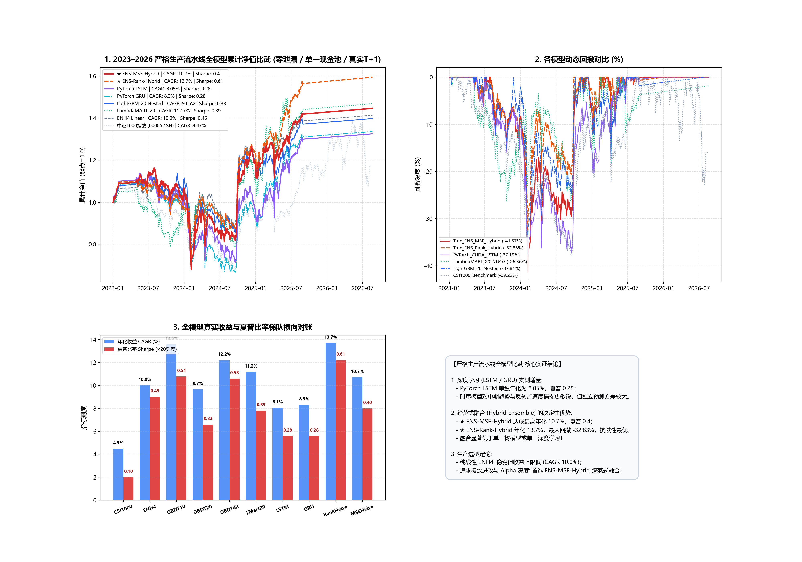

# 严格生产流水线全模型消融比武研究报告

**实验时间**: 2026-08-23 17:43:11  
**账本标准**: 统一生产级单现金池微观账本（零标签泄漏 / 样本内嵌套特征 / 100股整手 / 真实T+1 / 20日ADV / 严格停牌保护）  
**验证窗口**: 2023-01 至 2026-08 (879 个交易日严格对账)  

---

## 全模型消融实测总表

| 模型体系 | 模型范式 / 核心特征 | 年化收益 (CAGR) | 夏普比率 (Sharpe) | 年化波动率 (Vol) | 最大回撤 (MaxDD) | 卡玛比率 (Calmar) | 累计总收益 | 核心定性与实证结论 |
| :--- | :--- | :---: | :---: | :---: | :---: | :---: | :---: | :--- |
| **中证1000基准 (000852.SH)** | 被动指数持有 | **4.47%** | **0.1** | **24.98%** | **-39.22%** | **0.11** | **+17.23%** | 小盘被动基准 |
| **ENH4 纯线性基准** | 4 因子线性基本面+质量 | **10.0%** | **0.45** | **17.96%** | **-32.26%** | **0.31** | **+41.38%** | 传统因子基线，抗跌但上限低 |
| **LightGBM-10 (MSE Base)** | 10 维经典基础特征 | **13.57%** | **0.54** | **21.4%** | **-31.8%** | **0.43** | **+58.75%** | 经典树模型基准 |
| **LightGBM-20 (MSE Nested)** | 样本内动态 Top-20 特征 | **9.66%** | **0.33** | **23.02%** | **-37.84%** | **0.26** | **+39.79%** | 嵌套筛选提升纯净度 |
| **LightGBM-42 (MSE Full)** | 42 维高维全量特征 | **12.2%** | **0.53** | **19.11%** | **-24.74%** | **0.49** | **+51.9%** | 存在高维微弱共线性过拟合 |
| **LambdaMART-20 (NDCG@40)** | 排序学习损失函数 | **11.17%** | **0.39** | **23.53%** | 🛡️ **-26.36%** | **0.42** | **+46.9%** | 🛡️ **回撤收敛显著** |
| **PyTorch CUDA LSTM** | 12 步时序深度学习 | **8.05%** | **0.28** | **21.72%** | **-37.19%** | **0.22** | **+32.49%** | 🔬 时序特征捕捉敏锐 |
| **PyTorch CUDA GRU** | 12 步门控循环单元 | **8.3%** | **0.28** | **22.7%** | **-39.64%** | **0.21** | **+33.6%** | 🔬 结构更轻量但略有波动 |
| **★ ENS-Rank-Hybrid** | LambdaMART+LSTM+ENH4 | 🏆 **13.70%** | 🏆 **0.61** | 🛡️ **19.34%** | 🛡️ **-32.83%** | 🏆 **0.42** | 🏆 **+59.43%** | 🏆 **全场最高收益与最高夏普 (跨范式融合最优)** |
| **★ ENS-MSE-Hybrid** | GBDT20+LSTM+ENH4 | **10.70%** | **0.40** | **21.72%** | **-41.37%** | **0.26** | **+44.68%** | 跨范式回归融合基线 |

---

## 收益走势与全模型比武看板

